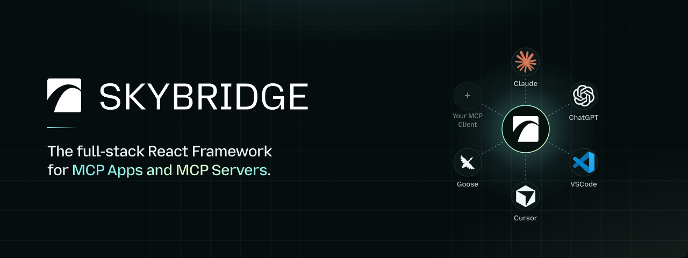
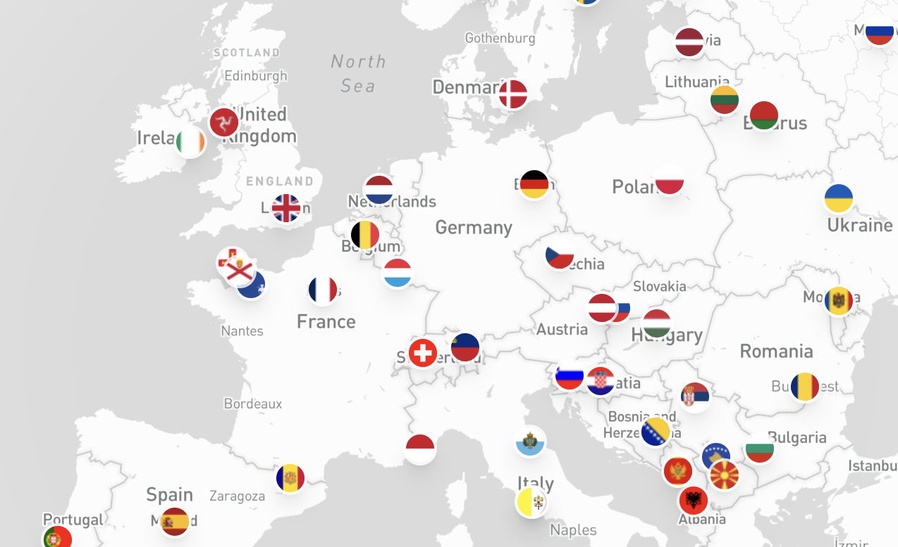
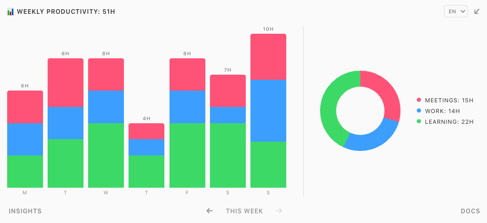
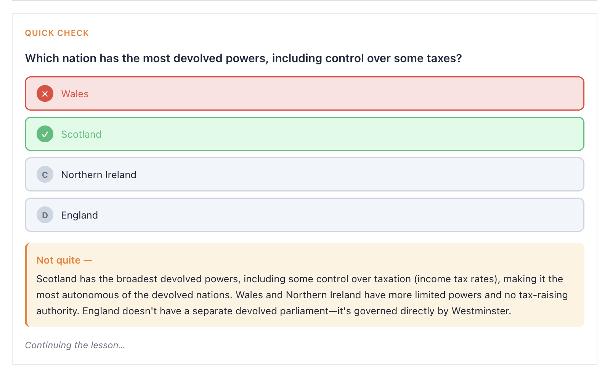
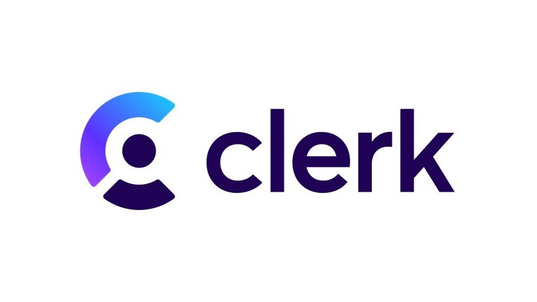
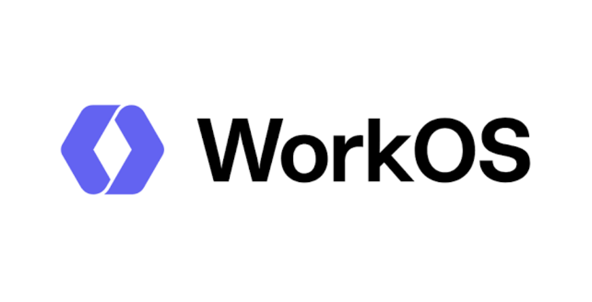
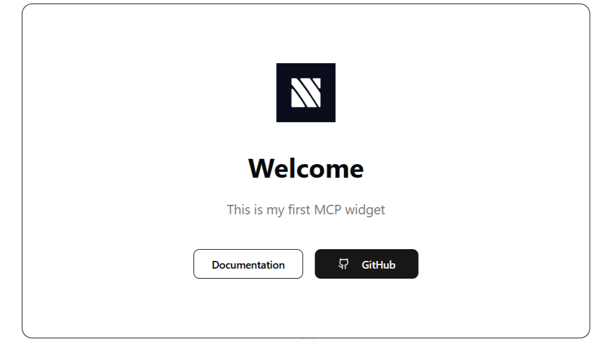

# Skybridge

<p align="center">
  <a href="https://docs.skybridge.tech">
    
  </a>
</p>

<p align="center">
  <strong>The full-stack React framework for MCP Apps and MCP Servers.</strong>
</p>

<p align="center">
  <a href="https://docs.skybridge.tech">Documentation</a> ·
  <a href="https://docs.skybridge.tech/quickstart/create-new-app">Quickstart</a> ·
  <a href="https://github.com/alpic-ai/skybridge/tree/main/examples">Examples</a>
</p>

<p align="center">
  <a href="https://www.npmjs.com/package/skybridge"><picture><source media="(prefers-color-scheme: dark)" srcset="https://img.shields.io/npm/v/skybridge?color=77F5EE&amp;labelColor=161B22&amp;style=for-the-badge"></picture></a>
  <a href="https://www.npmjs.com/package/skybridge"><picture><source media="(prefers-color-scheme: dark)" srcset="https://img.shields.io/npm/dm/skybridge?color=D7FFC8&amp;labelColor=161B22&amp;style=for-the-badge"></picture></a>
  <a href="https://discord.com/invite/gNAazGueab"><picture><source media="(prefers-color-scheme: dark)" srcset="https://img.shields.io/badge/Discord-community-77F5EE?style=for-the-badge&amp;logo=discord&amp;logoColor=77F5EE&amp;labelColor=161B22"></picture></a>
  <a href="https://github.com/alpic-ai/skybridge/blob/main/LICENSE"><picture><source media="(prefers-color-scheme: dark)" srcset="https://img.shields.io/github/license/alpic-ai/skybridge?color=D7FFC8&amp;labelColor=161B22&amp;style=for-the-badge"></picture></a>
</p>

## About Skybridge

Skybridge helps developers build type-safe MCP Apps for Claude, ChatGPT, Gemini and other UI enabled MCP Clients, with a complete set of devtools designed for both humans and agents.

MCP Apps extend the [Model Context Protocol](https://modelcontextprotocol.io/docs/getting-started/intro) with **rich, interactive UI views** rendered from MCP servers. Conversational apps need seamless interaction between the user, the UI, and the model. This means new UX patterns, developer tooling, and abstractions. This is why we built Skybridge.

Features include:

- **Delightful dev environment**: It provides a dev server with a local emulator, Hot Module Reload, and a permanent tunnel to connect your local app to Claude and ChatGPT.
- **Write once, run everywhere**: Skybridge abstracts implementation differences between MCP Clients, so your app runs seamlessly in Claude, ChatGPT, VSCode, and any other compatible MCP Apps client.
- **Agent-ready**: Powerful Skills, CLI, and programmatic DevTools APIs: it provides everything your coding agent needs to build MCP Apps end-to-end.
- **Type-safe end-to-end**: tRPC-style inference from MCP server tool definition to React view for type-safety end-to-end from server to frontend.
- **React-first**: Intuitive React Query-style hooks, with advanced state management. 
- **Examples library**: Get started quickly with production-ready app examples for e-commerce, travel, SaaS, and others.

These companies chose Skybridge to deploy their apps on ChatGPT and Claude stores: 

<p align="center">
  <a href="https://www.datadoghq.com"><picture><source media="(prefers-color-scheme: dark)" srcset="docs/images/user-logos/datadog-dark.svg"></picture></a>
  &nbsp;&nbsp;
  <a href="https://bitmovin.com"><picture><source media="(prefers-color-scheme: dark)" srcset="docs/images/user-logos/bitmovin-dark.svg"></picture></a>
  &nbsp;&nbsp;
  <a href="https://www.evaneos.com"><picture><source media="(prefers-color-scheme: dark)" srcset="docs/images/user-logos/evaneos-dark.svg"></picture></a>
  &nbsp;&nbsp;
  <a href="https://www.touchstream.media"><picture><source media="(prefers-color-scheme: dark)" srcset="docs/images/user-logos/touchstream-dark.svg"></picture></a>
  &nbsp;&nbsp;
  <a href="https://www.cottages.com"><picture><source media="(prefers-color-scheme: dark)" srcset="docs/images/user-logos/cottages-dark.svg"></picture></a>
</p>

## Get started

**For agents**

Install our [Skill](https://docs.skybridge.tech/devtools/skills) for MCP Apps and ChatGPT Apps:
```bash
npx skills add alpic-ai/skybridge -s skybridge
```
Once installed, if you ask your agent "_what skills do you have?_", it should mention the skybridge skill. Then, you can ask it to:

- _Create a new MCP App_
- _Migrate my MCP Server to the Skybridge framework_
- _Add a new view to my MCP App_ 

**For humans**

Bootstrap a new project with:
```bash
npm create skybridge my-app
```
For full install instructions, read the [**Quickstart section**](https://docs.skybridge.tech/quickstart/create-new-app) of our documentation.

## Documentation

The [Skybridge documentation](https://docs.skybridge.tech) covers the full lifecycle of building MCP Apps:

- [Fundamentals](https://docs.skybridge.tech/fundamentals): understand MCP Apps, ChatGPT Apps, and how Skybridge bridges both runtimes.
- [Core concepts](https://docs.skybridge.tech/concepts): learn about server <> model <> UI data flow, LLM context sync, type safety, and instant local iteration with our devtools.
- [Guides](https://docs.skybridge.tech/guides/fetching-data): build real app behavior with tools, views, state, and model communication.
- [API Reference](https://docs.skybridge.tech/api-reference): browse our MCP server APIs, React hooks, CLI commands, and runtime compatibility.

## Deploy

Deploy Skybridge apps instantly on [Alpic](https://alpic.ai) to get scalable hosting, MCP analytics, permanent tunnelling, MCP auditing and app stores submission help, or self-host on any Node.js-compatible platform.

Read the [deployment guide](https://docs.skybridge.tech/quickstart/deploy) for the full production path.

## Community & Contributing

We invite you to contribute and help improve Skybridge.

Here are a few ways you can get involved:

- **Reporting bugs**: If you run into a bug or unexpected behavior, please open an issue in [GitHub Issues](https://github.com/alpic-ai/skybridge/issues) with a clear reproduction.
- **Questions and Suggestions**: Need help building with Skybridge or have ideas to improve the framework, docs, examples, or developer experience? [Open an issue](https://github.com/alpic-ai/skybridge/issues) or share them on our [Discord](https://discord.com/invite/gNAazGueab).
- **Pull requests**: For code or documentation changes, please read the [Contributing Guide](https://github.com/alpic-ai/skybridge/blob/main/CONTRIBUTING.md) before opening a PR.

Skybridge is released under the [MIT License](https://github.com/alpic-ai/skybridge/blob/main/LICENSE).

### Contributors

Built and maintained by [Harijoe](https://github.com/harijoe), [Fred Barthelet](https://github.com/fredericbarthelet), and the [Alpic](https://alpic.ai) team.

<a href="https://github.com/alpic-ai/skybridge/graphs/contributors">
  
</a>

## Example templates

Explore all our example templates in the [Examples](https://docs.skybridge.tech/examples) section of the documentation.

### Basic

| Preview | App | Description | Demo | Code |
| --- | --- | --- | --- | --- |
|  | Everything | Comprehensive playground app showcasing all Skybridge hooks and features. | [Try Demo](https://everything.skybridge.tech/try) | [View code](https://github.com/alpic-ai/skybridge/tree/main/examples/everything) |

### Use cases

| Preview | App | Description | Demo | Code |
| --- | --- | --- | --- | --- |
|  | Capitals Explorer | Interactive world map with geolocation, country information, and dynamic capital exploration. | [Try Demo](https://capitals.skybridge.tech/try) | [View code](https://github.com/alpic-ai/skybridge/tree/main/examples/capitals) |
|  | Flight Booking | Flight search carousel with route details, pricing comparison, and external booking. | [Try Demo](https://flight-booking.skybridge.tech/try) | [View code](https://github.com/alpic-ai/skybridge/tree/main/examples/flight-booking) |
|  | Ecommerce Carousel | Product carousel with persistent cart, localization, theme switching, and modal dialogs. | [Try Demo](https://ecommerce.skybridge.tech/try) | [View code](https://github.com/alpic-ai/skybridge/tree/main/examples/ecom-carousel) |
|  | Investigation Game | Multi-screen mystery game with fullscreen mode, dynamic story progression and context asynchronicity demonstration | [Try Demo](https://investigation-game.skybridge.tech/try) | [View code](https://github.com/alpic-ai/skybridge/tree/main/examples/investigation-game) |
|  | Productivity | Interactive analytics dashboard with charts, theme adaptation, localization, fullscreen mode, and bidirectional tool calls. | [Try Demo](https://productivity.skybridge.tech/try) | [View code](https://github.com/alpic-ai/skybridge/tree/main/examples/productivity) |
|  | Time's Up | Word-guessing party game where the user gives hints and the AI tries to guess. | [Try Demo](https://times-up.skybridge.tech/try) | [View code](https://github.com/alpic-ai/skybridge/tree/main/examples/times-up) |
|  | Lumo — Interactive AI Tutor | Adaptive tutor with Mermaid diagrams, mind maps, quizzes, and fill-in-the-blank exercises. | [Try Demo](https://lumo-mcp-app-39519fdd.alpic.live/try) | [View code](https://github.com/connorads/lumo-mcp-app) |

### Auth

| Preview | Provider | Description | Code |
| --- | --- | --- | --- |
|  | Clerk | Full OAuth authentication with Clerk and personalized coffee shop search. | [View code](https://github.com/alpic-ai/skybridge/tree/main/examples/auth-clerk) |
|  | WorkOS AuthKit | Full OAuth authentication with WorkOS AuthKit and personalized coffee shop search. | [View code](https://github.com/alpic-ai/skybridge/tree/main/examples/auth-workos) |
|  | Stytch | Full OAuth authentication with Stytch and personalized coffee shop search. | [View code](https://github.com/alpic-ai/skybridge/tree/main/examples/auth-stytch) |
|  | Auth0 | Full OAuth authentication with Auth0 and personalized coffee shop search. | [View code](https://github.com/alpic-ai/skybridge/tree/main/examples/auth-auth0) |

### UI and component libraries

| Preview | App | Description | Demo | Code |
| --- | --- | --- | --- | --- |
|  | Manifest UI | Agentic component library example for rich AI-powered experiences. | [Try Demo](https://manifest-ui.skybridge.tech/try) | [View code](https://github.com/alpic-ai/skybridge/tree/main/examples/manifest-ui) |
|  | Generative UI | LLM-generated dynamic UIs with json-render and 36 pre-built shadcn/ui components. | [Try Demo](https://generative-ui.skybridge.tech/try) | [View code](https://github.com/alpic-ai/skybridge/tree/main/examples/generative-ui) |
