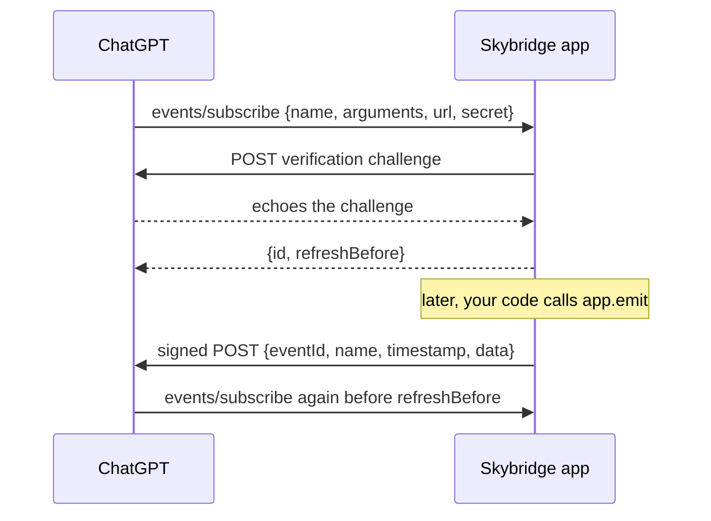

import { Compat } from "/components/compat.jsx";

<Compat chatgpt />

<Warning>
MCP Events is a draft from the MCP [Triggers & Events working group](https://github.com/modelcontextprotocol/experimental-ext-triggers-events), not part of the MCP specification yet. The feature is **experimental** and may change with the draft. ChatGPT is the only host that supports it today, through webhooks, in Work chats.
</Warning>

Tools only run when the model calls them. Events go the other way: the user asks ChatGPT to watch for something ("tell me when someone comments on this doc, and draft a reply"), ChatGPT subscribes to one of your event types, and every time your app emits a matching event, ChatGPT runs the user's instructions in that chat.

You declare event types with `registerEvent` and deliver occurrences with [`app.emit`](/api-reference/skybridge#emit). Skybridge implements the protocol around them: listing, subscribing and unsubscribing, verifying the callback URL, signing each delivery and retrying failed ones.

## Example

A document app lets users subscribe to new comments on one document.

```ts
export const app = new Skybridge({
  name: "docs",
  version: "1.0.0",
  oauth: workosProvider({ ... }),
  handler: (server) =>
    server.registerEvent(
      {
        name: "comment.created",
        description: "Fires when someone comments on a document",
        inputSchema: { documentId: z.string() },
        payloadSchema: {
          documentId: z.string(),
          commentId: z.string(),
          excerpt: z.string(),
        },
      },
      {
        match: (event, { arguments: args }) =>
          event.data.documentId === args.documentId,
        onSubscribe: async ({ documentId }, extra) => {
          await assertCanRead(extra.http?.authInfo, documentId);
        },
      },
    ),
});

await app.emit("comment.created", {
  id: comment.id,
  data: {
    documentId: comment.documentId,
    commentId: comment.id,
    excerpt: comment.text.slice(0, 280),
  },
});
```

## Parameters

### `config`

| Field | Purpose |
| --- | --- |
| `name` | Stable, specific event name such as `comment.created`. |
| `description` | What the event is and when it fires. The model reads it to decide what to subscribe to. |
| `inputSchema` | Subscription arguments, usually filters. A Zod shape or a Standard Schema object, like a tool's `inputSchema`. |
| `payloadSchema` | Shape of the delivered `data`. `app.emit` validates against it and types its `data` from it. |
| `_meta` | Optional metadata listed with the event. |

### `hooks`

| Field | Purpose |
| --- | --- |
| `match` | Receives the emitted event and a subscription's `arguments` and `principal`, and returns whether that subscription gets it. Without it, every subscription to the event receives every emit. |
| `onSubscribe` | Runs on every subscribe, including the host's periodic refreshes, once the callback URL is verified, with the validated arguments and the request `extra`. Throw to reject the subscription, for example when the user may not access the document. |

Returns the server, so calls chain, and adds the event to the app's types so `app.emit` checks the name and payload.

## How it works



- Subscribing requires a signed-in user: set [`oauth`](/api-reference/skybridge#oauth). The subscription belongs to the token's subject, or to its client ID when the token has no subject.
- Skybridge verifies a callback URL before the first delivery to it, signs every delivery with the subscription's secret ([Standard Webhooks](https://www.standardwebhooks.com/)), and retries failed deliveries twice. `app.emit` validates `data` against `payloadSchema` and resolves once each delivery has had a first attempt. It rejects with an `AggregateError` when `match` hooks throw, after delivering to the other subscriptions, so you can log or retry.
- Callback URLs must be `https` and resolve to public addresses. When `NODE_ENV` is `development` (the default under `skybridge dev`) or `test`, `http` and local addresses are allowed so you can test with a local receiver.
- Subscriptions last 30 minutes unless the host asks for another lifetime, at most 24 hours. The host re-subscribes before they expire.
- Payloads are capped at 256 KiB. Send a summary and let the model fetch the rest with a tool.
- Events are not replayed: an event emitted while a subscription has lapsed is lost.

## Where subscriptions live

Subscriptions are kept in memory by default, which works for a single long-running process. A restart loses them until the host's next refresh, which can be up to 24 hours away, and events emitted in between are not delivered. When the app runs on several instances, `app.emit` can run on an instance that never saw the subscription, so pass a shared store with the [`events`](/api-reference/skybridge#events) option.

```ts
import type { EventStore } from "skybridge/server";

const store: EventStore = {
  get: (id) => db.subscriptions.find(id),
  set: (subscription) => db.subscriptions.upsert(subscription),
  delete: (id) => db.subscriptions.remove(id),
  listByEvent: (name) => db.subscriptions.where({ name }),
};

new Skybridge({ name: "docs", version: "1.0.0", events: { store }, handler });
```

<CardGroup cols={2}>
  <Card title="Skybridge" icon="box" href="/api-reference/skybridge">
    The `events` option and `app.emit`
  </Card>
  <Card title="McpServer" icon="server" href="/api-reference/mcp-server">
    Every method of the server
  </Card>
</CardGroup>
