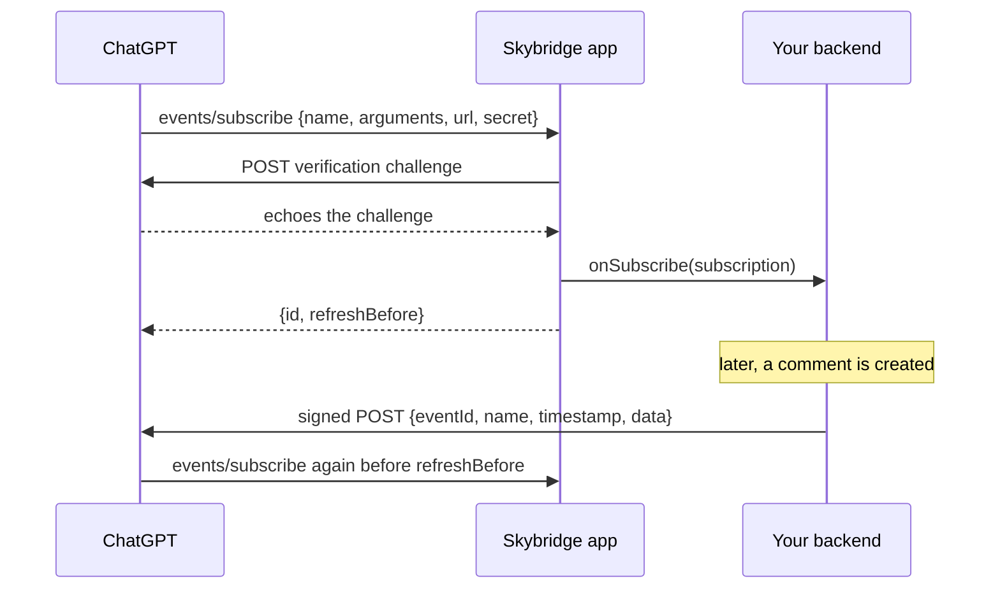

import { Compat } from "/components/compat.jsx";

<Compat chatgpt />

<Warning>
MCP Events is a draft from the MCP [Triggers & Events working group](https://github.com/modelcontextprotocol/experimental-ext-triggers-events), not part of the MCP specification yet. The feature is **experimental** and may change with the draft. ChatGPT is the only host that supports it today, through webhooks, in Work chats.
</Warning>

Tools only run when the model calls them. Events go the other way: the user asks ChatGPT to watch for something ("tell me when someone comments on this doc, and draft a reply"), ChatGPT subscribes to one of your event types with a callback URL, and every time a matching event is POSTed to that URL, ChatGPT runs the user's instructions in that chat.

`registerEvent` handles the subscription side of the protocol. Skybridge lists your event types, checks who is subscribing and with which arguments, verifies the callback URL, and then hands the subscription to your `onSubscribe` hook. Delivering the events is up to whatever already knows when they happen, usually your backend's webhook system. [`deliverEvent`](#deliverevent) does the delivery for you when that system runs on Node.

## Example

A document app lets users subscribe to new comments on one document. Its backend already sends webhooks, so `onSubscribe` registers ChatGPT's callback there.

```ts
export const app = new Skybridge({
  name: "docs",
  version: "1.0.0",
  oauth: workosProvider({ ... }),
  handler: (server) =>
    server.registerEvent(
      {
        name: "comment.created",
        description: "Fires when someone comments on a document",
        inputSchema: { documentId: z.string() },
        payloadSchema: {
          documentId: z.string(),
          commentId: z.string(),
          excerpt: z.string(),
        },
      },
      {
        onSubscribe: async ({ documentId }, { subscription, extra }) => {
          const userId = extra.http?.authInfo?.extra?.subject;
          await assertCanRead(userId, documentId);
          await api.upsertWebhook({
            id: subscription.id,
            url: subscription.url,
            signingSecret: subscription.secret,
            expiresAt: subscription.expiresAt,
            event: "comment.created",
            filter: { documentId },
          });
        },
        onUnsubscribe: async (_args, { subscription }) => {
          await api.deleteWebhook(subscription.id);
        },
      },
    ),
});
```

## Parameters

### `config`

| Field | Purpose |
| --- | --- |
| `name` | Stable, specific event name such as `comment.created`. |
| `description` | What the event is and when it fires. The model reads it to decide what to subscribe to. |
| `inputSchema` | Subscription arguments, usually filters. A Zod shape or a Standard Schema object, like a tool's `inputSchema`. |
| `payloadSchema` | Shape of the delivered `data`, listed so the host knows what to expect. |
| `_meta` | Optional metadata listed with the event. |

### `hooks`

| Field | Purpose |
| --- | --- |
| `onSubscribe` | Runs on every subscribe, including the host's periodic refreshes, once the callback URL is verified. Receives the validated arguments and `{ subscription, extra }`. Store or update the subscription by `subscription.id`. Throw to reject it, for example when the user may not access the document. |
| `onUnsubscribe` | Runs when the host unsubscribes, with the arguments and `{ subscription: { id }, extra }`. Stop delivering to that `id`: Skybridge keeps no subscriptions, so this hook is the only way the cancellation reaches your delivery side. |

`subscription` carries:

| Field | Purpose |
| --- | --- |
| `id` | Stable across refreshes: the same user subscribing to the same event with the same arguments and callback URL always gets the same `id`. Two users get separate subscriptions. |
| `url` | Where to POST the events. |
| `secret` | The signing secret the host chose. A refresh may bring a new one; sign with both the old and the new one for a few minutes. |
| `expiresAt` | When the subscription lapses. The host refreshes it before then, which calls `onSubscribe` again with a later date. Stop delivering after it. |

`extra` is the same as in a [`registerTool`](/api-reference/register-tool) handler: `extra.http.authInfo` tells you who is subscribing.

Returns the server, so calls chain.

## `deliverEvent`

```ts
import { deliverEvent } from "skybridge/server";

const result = await deliverEvent(subscription, {
  name: "comment.created",
  id: comment.id,
  data: { documentId, commentId: comment.id, excerpt },
});
if (!result.ok && result.retryable) {
  await queue.retryLater(subscription, comment);
}
```

POSTs one event to a subscription the way MCP Events expects: the event envelope, [Standard Webhooks](https://www.standardwebhooks.com/) signature headers and a 10 second deadline. Outside development it refuses to connect to private addresses. Pass the upstream's own identifier as `id` so the host can drop duplicates, and reuse it when retrying. Pass `secret` as an array to sign with several secrets during a rotation. A subscription past its `expiresAt` is not posted to and returns `{ ok: false, reason: "expired", retryable: false }`. Otherwise it makes one attempt and returns `{ ok: true }` or `{ ok: false, reason, retryable, status }`, where `status` is the HTTP status when the host answered. A `410` or `413` is not retryable. Retrying is up to you.

## How it works



- Subscribing requires a signed-in user: set [`oauth`](/api-reference/skybridge#oauth).
- Callback URLs must be `https` and resolve to public addresses. When `NODE_ENV` is `development` (the default under `skybridge dev`) or `test`, `http` and local addresses are allowed so you can test with a local receiver.
- Subscriptions last 30 minutes unless the host asks for another lifetime, at most 24 hours.
- Payloads are capped at 256 KiB. Send a summary and let the model fetch the rest with a tool.
- Events are not replayed: an event sent while a subscription has lapsed is lost.

<CardGroup cols={2}>
  <Card title="registerTool" icon="wrench" href="/api-reference/register-tool">
    Tools the model calls, and the `extra` they receive
  </Card>
  <Card title="McpServer" icon="server" href="/api-reference/mcp-server">
    Every method of the server
  </Card>
</CardGroup>
