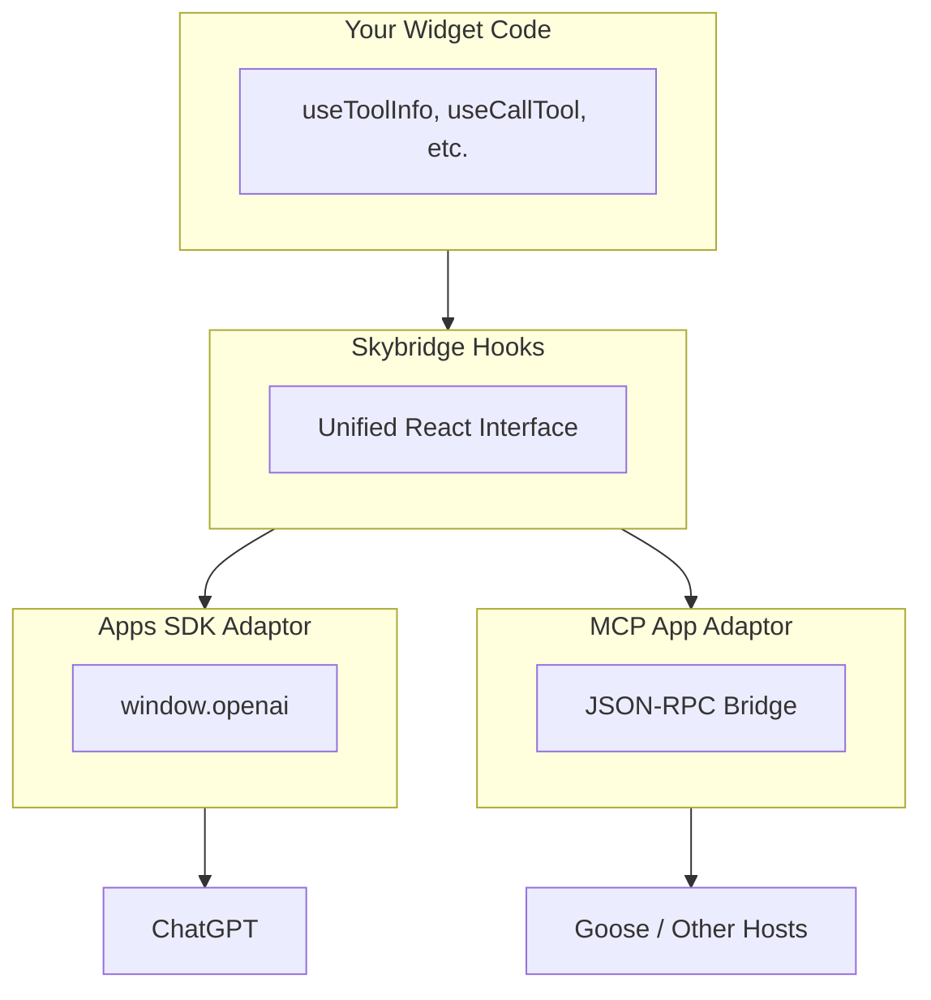

Skybridge is designed to be **runtime-agnostic**. Your widget code works the same whether it runs in ChatGPT (via Apps SDK) or in MCP-compatible clients like Goose.

## The Problem

Different AI platforms use different APIs to communicate with embedded widgets:

- **ChatGPT** uses the Apps SDK with `window.openai` global
- **MCP Apps** use JSON-RPC postMessage protocol (MCP ext-apps spec)

Without abstraction, you'd need to write different code for each platform—or lock yourself into one ecosystem.

## Skybridge's Solution

Skybridge introduces an **adaptor layer** that normalizes these differences:

Skybridge automatically detects which runtime is available and uses the appropriate adaptor.

## Benefits

<CardGroup cols={2}>
  <Card title="Future-Proof" icon="shield">
    As new AI platforms adopt MCP, your widgets will work without code changes
  </Card>
  <Card title="No Vendor Lock-in" icon="unlock">
    Ship to ChatGPT today, expand to Claude and others tomorrow
  </Card>
  <Card title="Single Codebase" icon="code">
    One set of hooks, one mental model, multiple platforms
  </Card>
  <Card title="Graceful Degradation" icon="stairs">
    Platform-specific features degrade gracefully with clear warnings
  </Card>
</CardGroup>

## Runtime Compatibility

Not all features are available on all platforms. See the [API Reference](/api-reference#runtime-compatibility) for a full compatibility matrix.

**Key differences:**
- `useFiles` is **Apps SDK only**
- `useRequestModal` MCP Apps support coming soon (will render in-iframe)
- `useDisplayMode` doesn't support "modal" mode in MCP Apps
- `useWidgetState` is **Apps SDK only**

<Tip>
Check individual hook documentation for runtime-specific notes and limitations.
</Tip>

## Related

- [Apps SDK (ChatGPT)](/fundamentals/apps-sdk) - ChatGPT-specific features and APIs
- [MCP Apps](/fundamentals/mcp-apps) - MCP ext-apps specification details
- [API Reference](/api-reference) - Full hook compatibility matrix
