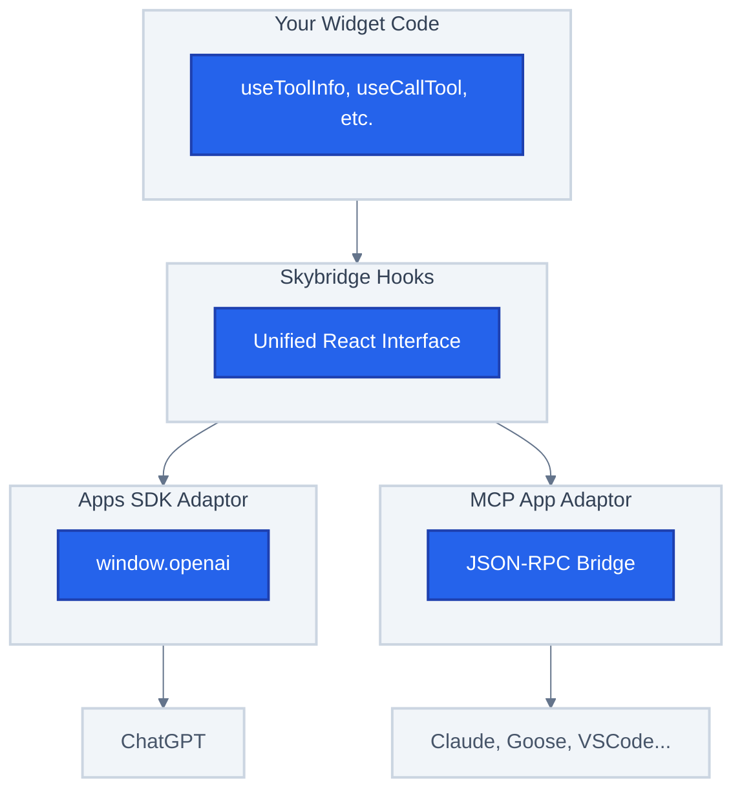

Skybridge is designed to be **runtime-agnostic**. Your widget code works the same whether it runs in MCP Apps compatible clients (like Claude, Goose, VSCode) via the MCP ext-apps specification, or in ChatGPT via the Apps SDK.

## The Problem

Different AI runtimes use different APIs to communicate with embedded widgets:

- **ChatGPT** uses the Apps SDK with `window.openai` global
- **MCP Apps** use JSON-RPC postMessage protocol (MCP ext-apps spec)

Without abstraction, you'd need to write different code for each platform — or lock yourself into one ecosystem.

## Skybridge's Solution

Skybridge introduces an **adaptor layer** that normalizes these differences:

These include [useToolInfo](/api-reference/use-tool-info), [useCallTool](/api-reference/use-call-tool), and other [API hooks](/api-reference). Skybridge automatically detects which runtime is available and uses the appropriate adaptor.

## Benefits

<CardGroup cols={2}>
  <Card title="Future-Proof" icon="shield">
    As new AI platforms adopt MCP, your widgets will work without code changes
  </Card>
  <Card title="No Vendor Lock-in" icon="unlock">
    Build once, deploy to multiple AI clients: ChatGPT, Claude, Goose, VSCode, and more
  </Card>
  <Card title="Single Codebase" icon="code">
    One set of hooks, one mental model, multiple platforms
  </Card>
  <Card title="Graceful Degradation" icon="stairs">
    Platform-specific features degrade gracefully with clear warnings
  </Card>
</CardGroup>

## Runtime Compatibility

Not all features are available on all platforms. See the [API Reference](/api-reference#runtime-compatibility) for a full compatibility matrix.

**Runtime-specific features:**
- [useFiles](/api-reference/use-files), [useSetOpenInAppUrl](/api-reference/use-set-open-in-app-url) are Apps SDK only
- [useWidgetState](/api-reference/use-widget-state) and [data-llm](/api-reference/data-llm) attribute in MCP Apps is polyfilled to persist state, and doesn't persist state across widget renders
- [useRequestModal](/api-reference/use-request-modal) in MCP Apps is polyfilled to render in an iframe instead of a host modal

## Related

- [MCP Apps](/fundamentals/mcp-apps) - The open MCP ext-apps specification and client support
- [Apps SDK (ChatGPT)](/fundamentals/apps-sdk) - ChatGPT-specific features and APIs
- [API Reference](/api-reference) - Full hook compatibility matrix
