# LLM Context Sync: Keeping the Model Informed

**Problem:** Your widget shows interactive UI, but the LLM doesn't know what the user is seeing. When the user asks "What's the price of this one?", the model has no idea which item "this one" refers to.

**Solution:** The `data-llm` attribute creates a live description of your widget's state that the model can read.

## The Dual Interaction Surface

ChatGPT Apps have a unique challenge: **two interaction surfaces**.

```mermaid
flowchart TB
    subgraph chat["💬 ChatGPT Conversation"]
        U1["🧑 Show me flights to Paris"]
        A1["🤖 Here are available flights:"]
    end

    subgraph widget["🖼️ Your Widget"]
        F1["✓ Flight AF123 - $450"]
        F2["Flight BA456 - $520"]
        F3["Flight LH789 - $480"]
    end

    U2["🧑 What's the baggage policy for this one?"]

    chat --> widget
    widget --> U2

    style F1 fill:#2d7a9a,color:#fff
```



The user clicked Flight AF123, but the model only sees the conversation text—it doesn't know what "this one" refers to.

## How data-llm Solves This

Add `data-llm` attributes to describe what the user is seeing:

```tsx
export function FlightWidget() {
  const [selectedFlight, setSelectedFlight] = useState(null);

  return (
    <div data-llm={selectedFlight
      ? `User is viewing details for flight ${selectedFlight.id}: ${selectedFlight.name}`
      : "User is browsing the flight list"
    }>
      {flights.map(flight => (
        <div
          key={flight.id}
          onClick={() => setSelectedFlight(flight)}
          data-llm={`Flight option: ${flight.name} for $${flight.price}`}
        >
          {flight.name} - ${flight.price}
        </div>
      ))}
    </div>
  );
}
```

Now when the user asks about "this one", ChatGPT appends this context to the conversation:

```
Widget context:
- User is viewing details for flight AF123: Air France 123
  - Flight option: AF123 Air France for $450 (selected)
  - Flight option: BA456 British Airways for $520
  - Flight option: LH789 Lufthansa for $480
```

The model can now understand "this one" = Flight AF123.

## How It Works Under the Hood

1. **Build time**: The Vite plugin transforms `data-llm` attributes into `DataLLM` React components
2. **Runtime**: `DataLLM` components register their content in a global tree
3. **State sync**: When content changes, the tree generates a hierarchical string
4. **Model context**: This string is stored in `window.openai.widgetState.__widget_context`
5. **LLM reads**: ChatGPT includes this context when generating responses

```tsx
// What you write:
<div data-llm="User viewing flight details">Content</div>

// What the plugin generates:
<DataLLM content="User viewing flight details">
  <div>Content</div>
</DataLLM>
```

:::tip data-llm vs sendFollowUpMessage
| | `data-llm` | `sendFollowUpMessage` |
|---|---|---|
| **When** | User types a message | Immediately |
| **Use for** | Describe UI state | Prompt the model |

User selects flight → `data-llm`. User clicks "Book" → `sendFollowUpMessage`.
:::

## Best Practices

### Do: Describe what the user sees

```tsx
// Good: Describes visible state
<div data-llm={`Showing ${items.length} search results for "${query}"`}>
```

### Do: Update on user interaction

```tsx
// Good: Context changes when user acts
<div data-llm={selectedTab === "details"
  ? "User is viewing product details"
  : "User is viewing reviews"
}>
```

### Don't: Include sensitive data

```tsx
// Bad: Don't expose internal IDs or tokens
<div data-llm={`Session ID: ${sessionId}`}>

// Good: Describe the semantic meaning
<div data-llm="User is logged in">
```

**Why?** The `data-llm` content is sent to ChatGPT's servers and included in the model's context. Avoid exposing tokens, passwords, internal IDs, or any data you wouldn't want in a prompt.

### Don't: Sync everything

```tsx
// Bad: Too much noise
<div data-llm={`Button hovered: ${isHovered}, scroll: ${scrollY}`}>

// Good: Only meaningful state
<div data-llm={`Viewing page ${currentPage} of ${totalPages}`}>
```

### Do: Nest for hierarchy

```tsx
<div data-llm="Shopping cart">
  {items.map(item => (
    <div key={item.id} data-llm={`${item.name}: ${item.quantity}x $${item.price}`}>
      {item.name}
    </div>
  ))}
  <div data-llm={`Total: $${total}`}>Total: ${total}</div>
</div>
```

Generates:
```
Shopping cart
  T-Shirt: 2x $25
  Jeans: 1x $60
  Total: $110
```

## Expression Limitations

Keep `data-llm` expressions simple (strings, ternaries, template literals). Pre-compute complex logic:

```tsx
// ✅ Simple expressions work
<div data-llm={isOpen ? "Menu open" : "Menu closed"}>
<div data-llm={`Selected: ${item.name}`}>

// ❌ Complex expressions may fail — compute first
const selectedNames = items.filter(item => item.selected).map(item => item.name).join(", ");
<div data-llm={`Selected: ${selectedNames}`}>
```

## __widget_context Reserved Key

Skybridge uses a reserved key `__widget_context` in widget state:

```typescript
window.openai.widgetState = {
  // Your app state
  selectedItemId: "123",
  filters: { ... },

  // Skybridge's context (auto-managed)
  __widget_context: "User viewing item 123\n  Price: $50\n  In stock"
}
```

This key is:
- Automatically managed by `DataLLM` components
- Filtered out when you use `useWidgetState` (you only see your own state)
- Read by ChatGPT when the user sends a message (passive context)

## Example: Multi-step Wizard

```tsx
function CheckoutWizard() {
  const [step, setStep] = useState(1);
  const [cart, setCart] = useState([]);
  const [shipping, setShipping] = useState(null);

  return (
    <div data-llm={`Checkout wizard - Step ${step} of 3`}>
      {step === 1 && (
        <div data-llm="Reviewing cart items">
          {cart.map(item => (
            <div key={item.id} data-llm={`${item.name} x${item.qty}`}>
              {item.name}
            </div>
          ))}
        </div>
      )}

      {step === 2 && (
        <div data-llm={shipping
          ? `Selected shipping: ${shipping.method} - $${shipping.cost}`
          : "Choosing shipping method"
        }>
          {/* Shipping options */}
        </div>
      )}

      {step === 3 && (
        <div data-llm="Ready to confirm payment">
          {/* Payment form */}
        </div>
      )}
    </div>
  );
}
```

Now when the user says "go back" or "what did I select?", the model knows exactly where they are and what they've done.

**What the model receives when user completes step 1:**

```
Widget context:
- Checkout wizard - Step 1 of 3
  - Reviewing cart items
    - T-Shirt x2
    - Jeans x1
```

**What the model receives when user is on step 2:**

```
Widget context:
- Checkout wizard - Step 2 of 3
  - Selected shipping: Express - $15
```


## Related

- [data-llm API Reference](/api-reference/utilities/data-llm) - Full API documentation
- [Communicating with the Model Guide](/guides/communicating-with-model) - More patterns
- [useSendFollowUpMessage](/api-reference/hooks/use-send-follow-up-message) - Send messages to the conversation
