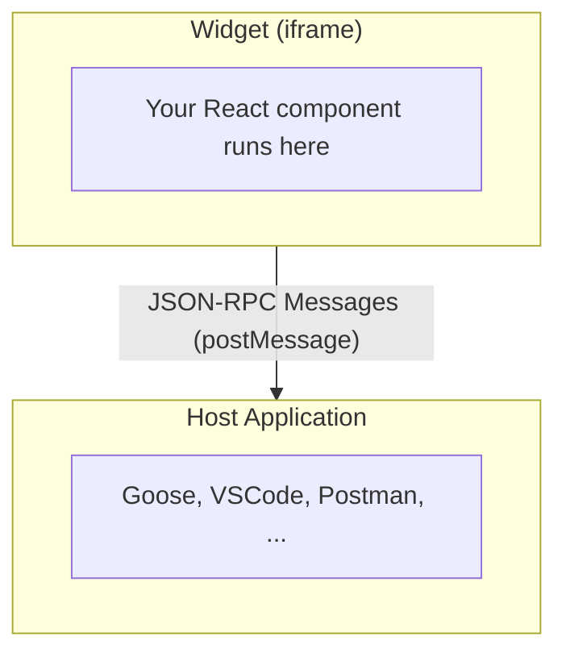

MCP Apps are based on the [MCP ext-apps specification](https://github.com/modelcontextprotocol/ext-apps)—an open standard for rendering interactive UI widgets inside AI conversations. Unlike the proprietary Apps SDK, MCP Apps work across multiple AI clients.

## How MCP Apps Work

MCP Apps use a **JSON-RPC postMessage bridge** for communication between the widget iframe and the host application:

The widget sends requests and receives responses via structured JSON-RPC messages, rather than calling methods on a global object.

## Supported Methods

The MCP ext-apps spec defines these communication methods:

### Guest-to-Host Requests

| Method | Description |
|--------|-------------|
| `ui/initialize` | Handshake to establish connection |
| `ui/open-link` | Open external URLs |
| `ui/message` | Send follow-up messages to the conversation |
| `ui/request-display-mode` | Request display mode change |
| `ui/update-model-context` | Update widget state for the model |
| `tools/call` | Invoke MCP tools |

### Host-to-Guest Notifications

| Notification | Description |
|--------------|-------------|
| `notifications/context-changed` | Theme, locale, or display mode changed |
| `notifications/tool-input` | Tool arguments provided |
| `notifications/tool-result` | Tool execution completed |

## Client Support

MCP Apps are supported by clients implementing the ext-apps specification, these include Goose, VSCode, Postman, ...

<Note>
MCP Apps is an emerging specification. Client support is expanding as more AI applications adopt the standard.
</Note>

## Skybridge Implementation

Skybridge implements the MCP ext-apps specification via the `McpAppAdaptor`.
This happens automatically: you write the same hooks regardless of runtime.

## Differences from Apps SDK

| Feature | Apps SDK | MCP Apps |
|---------|----------|----------|
| **Modal Windows** | Portaled to host | Coming soon (in-iframe) |
| **File Upload/Download** | Supported | Not supported |
| **Display Mode "modal"** | Supported | Not supported |

### Handling Platform Differences

When using Apps SDK features in MCP Apps:

- **`useFiles()`**: Not yet supported
- **`useRequestModal()`**: Coming soon (will render in-iframe)
- **`useDisplayMode("modal")`**: Not yet supported
- **`useWidgetState()`**: Not yet supported (MCP spec doesn't define widget state)

<Tip>
**Graceful degradation planned**: We're working to ensure host-specific features never throw errors. Instead, they'll degrade gracefully—running in a minimal but functional way so your app works everywhere.
</Tip>

<Warning>
Always check the [compatibility matrix](/api-reference#runtime-compatibility) before using platform-specific features.
</Warning>

## Protocol Coverage

Skybridge is actively implementing the MCP ext-apps specification. Track our progress and see detailed coverage in [GitHub Issue #14](https://github.com/alpic-ai/skybridge/issues/14).

## Testing MCP Apps

Since the DevTools emulator currently uses the Apps SDK runtime, testing MCP Apps requires:

1. Running your MCP server locally
2. Connecting from a client that supports MCP Apps (e.g., Goose)
3. Invoking tools that render widgets

<Tip>
Use DevTools for rapid development, then validate in MCP Apps clients for final testing.
</Tip>

## Related

- [Apps SDK (ChatGPT)](/fundamentals/apps-sdk) - The ChatGPT-specific runtime
- [Platform Agnosticism](/concepts/platform-agnosticism) - How Skybridge abstracts these differences
- [API Reference](/api-reference#runtime-compatibility) - Full compatibility matrix
