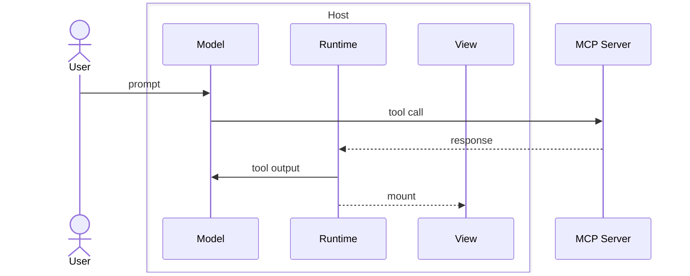
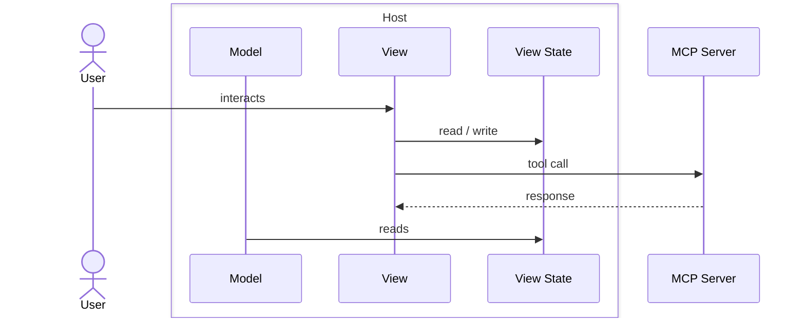
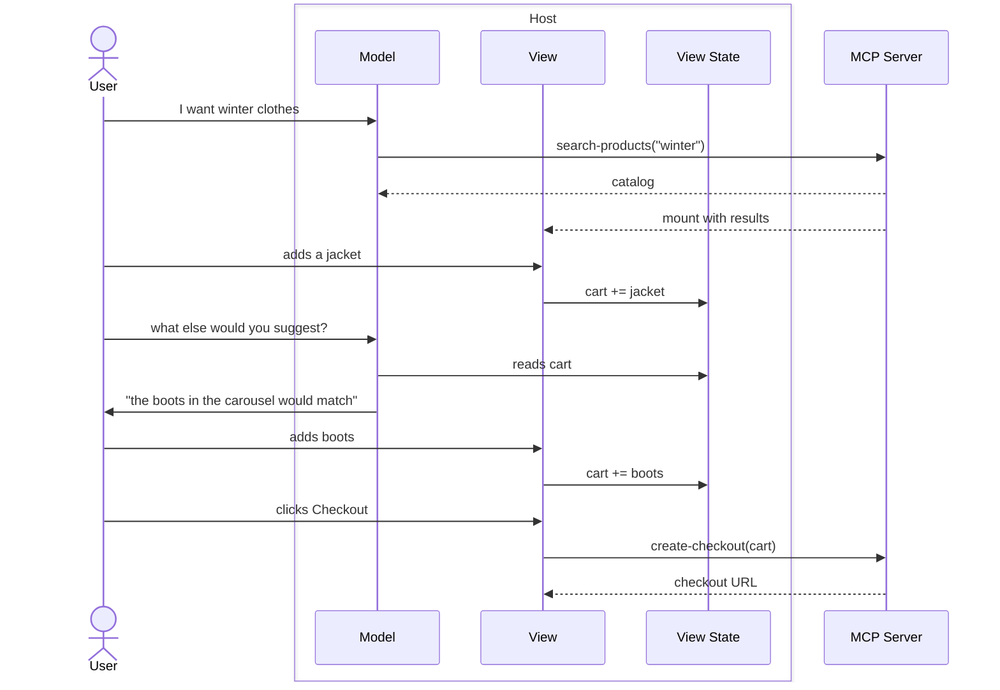

{/* todo: three body problem illustration */}

MCP Apps have three actors involved: the view, the user, and the model. This creates context asymmetry: each actor holds a partial picture of the system. The model is blind to the UI: it can’t see visuals or user interactions unless you explicitly sync them back. The user can’t see the tool output flowing underneath. Building well means understanding these blind spots and designing the information flow between all three.

The core design challenge isn’t layout or styling: it’s deciding who sees what, and when. What does the model need to know and when? What should stay hidden from it? Where should natural language replace traditional UI?

The sections below introduce the vocabulary, walk through the lifecycle an app and how data flows at each step, and close with a working example that ties everything together.

## Terminology

A few MCP-App-specific terms used throughout this section:

- **Host**: the AI client that embeds the model and runs your app (e.g., ChatGPT, Claude)
- **MCP App**: the unit you build; a server exposing tools, plus optional views
- **MCP Server**: the tool set exposed to models and views
- **Tool**: a function on the server that the model or a view can call
- **View**: a React component shipped bound to a tool and rendered inside the host
- **Runtime**: the host's bridge between the server's response, the model, and the view
- **View Instance**: one mounted occurrence of a view
- **View State**: state attached to a view instance

## App Lifecycle

An MCP App moves through three phases: it's **mounted** when a tool call brings the view into the conversation, it **runs** while the user interacts with that view, and it's **torn down** when the conversation closes. Each phase changes who's driving and what data flows where.

### App is Mounted

The user talks to the model, which calls a tool on your server. The server's response includes:
- a view reference that the host uses to mount the view inline with the conversation
- an output (text, structured content, media) shared with the model and fed to the view

A new instance of the view will be mounted each time the model calls the associated tool.



<Info>
The tool output shape lets you address each piece of data to a specific recipient: some fields can be sent only to the model, some only to the view, and some to both. Choosing the recipient is a design decision: it controls what context each actor sees.
</Info>

### App is Running

Once mounted, the view becomes the active surface where the user can trigger:
- tool calls
- state mutations

State is shared with both the view and the model so the model stays aware of what's happening on screen. Only the view can mutate the state. Each view instance has its own state.



<Info>
The view can call the tools it's bound to, or any other tool. Tool calls initiated from the view won't mount views.
</Info>

### App Teardown

When the conversation is closed, every view instance unmounts. The next time it's loaded, each one remounts with its own state restored.

## Hands On: Build a Personal Shopper

A shopping app driven by two tools: `search-products` and `create-checkout`. The user tells the model what they're looking for; the model calls `search-products` once to surface a catalog in a carousel; from there the user picks items, and a view-side button hands off to `create-checkout` when they're ready to pay.

What turns the model into a *personal shopper* is **state**. The view holds the cart and the currently displayed products. The model reads them to give context-aware advice in chat, pointing at items already on screen based on what's been added.

Here's how it plays out at runtime:



And the implementation:

<CodeGroup>
```ts server.ts
import { McpServer } from "skybridge/server";
import { z } from "zod";

const server = new McpServer({ name: "personal-shopper", version: "0.0.1" }, {})
  .registerTool(
    {
      name: "search-products",
      description: "Show products matching a query in a carousel.",
      inputSchema: { query: z.string() },
      view: { component: "carousel" },
    },
    async ({ query }) => {
      return { structuredContent: { products: await search(query) } };
    },
  )
  .registerTool(
    {
      name: "create-checkout",
      description: "Create a checkout session for the cart.",
      inputSchema: { productIds: z.array(z.string()) },
    },
    async ({ productIds }) => {
      return { structuredContent: { url: await checkout(productIds) } };
    },
  );
```

```tsx views/carousel.tsx
import { useViewState } from "skybridge/web";
import { useToolInfo, useCallTool } from "../helpers.js"; // generated, type-safe from server schema

export default function Carousel() {
  const { output } = useToolInfo<"search-products">();
  const [cart, setCart] = useViewState<{ ids: string[] }>({ ids: [] });
  const { callTool: checkout } = useCallTool("create-checkout");

  return (
    <Catalog
      products={output.products}
      cart={cart.ids}
      onAdd={(id) => setCart({ ids: [...cart.ids, id] })}
      onCheckout={() => checkout({ productIds: cart.ids })}
    />
  );
}
```
</CodeGroup>

## Pair with the Skill

The Skybridge Skill is the best teacher for crafting MCP App UX. It knows the lifecycle, the data-flow patterns, and the design moves that actually work inside ChatGPT and Claude.

Install it now:

```bash
npx skills add alpic-ai/skybridge -s skybridge
```