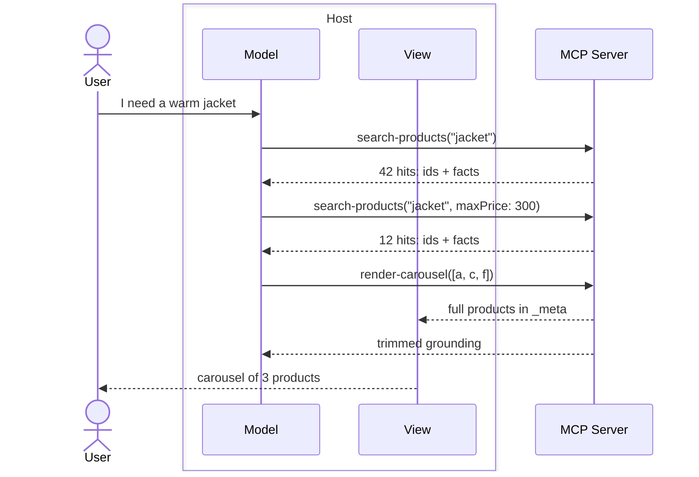
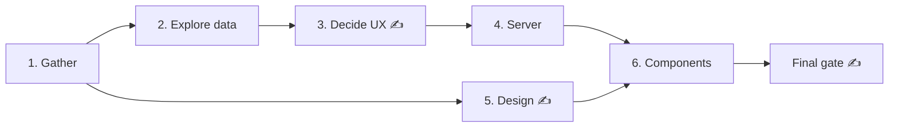

Ecommerce inside a conversation is a hard UX problem. A storefront's job has to fit the host-controlled frame, and merchandising moves to a model.

The `ecom` template ships that architecture as a skeleton, with opinionated patterns refined by the [Alpic build team](https://alpic.ai/solutions/build/studio): an iterative search loop, an inline carousel opening into a fullscreen product detail, sparse variant selection, and a token-based design system. The wiring is in place, the data is not: a coding agent skill fills in your catalog and brand, pausing for your sign-off at each design decision.

## Scaffold the Template

Scaffold a project with the `--ecom` flag:

```bash
npx skybridge create my-shop --ecom
```

The template works best with the `chatgpt-app-builder` skill, which drives the fill workflow below. The scaffolder installs it by default; to add it to an existing project:

```bash
npx skills add alpic-ai/skybridge --skill chatgpt-app-builder
```

## Install the Tooling

A few MCP servers let the agent do work it would otherwise hand back to you:

- **[Chrome DevTools MCP](https://github.com/ChromeDevTools/chrome-devtools-mcp)**: a browser for the agent: it [drives the local DevTools](/test/devtools#drive-devtools-from-a-coding-agent) to verify its own work, previews UI components, and inspects your live site's styles for token extraction.
- **[Playwright MCP](https://github.com/microsoft/playwright-mcp)**: the same, as a fallback when Chrome DevTools is unavailable.
- **[Figma MCP](https://www.figma.com/mcp-catalog/):** if your brand lives in Figma, the agent extracts color ramps, type scale, and spacing itself.

All are optional: without them, the agent asks you instead.

## What the Template Ships

Four patterns carry the app. The fill workflow customizes their values, never their shape.

### Search, Then Render

Two [tools](/build/tools) split the flow. `search-products` takes a keyword, filters, and a sort, and returns matching products as model-facing structured output. `render-carousel` takes the curated ids in display order and mounts the carousel [view](/build/view).

Prompts drive an iterative loop: the model searches several times, varying keywords and filters, then curates a handful of ids. Raw search results never render: they ground the curation.



`render-carousel` answers on three channels: full products (every variant, all media) ride `_meta` for the view; a trimmed projection goes to `structuredContent` so the model can answer follow-ups; `content` is a one-line status.

### Open the Product Detail

Tapping a card switches to `fullscreen` and renders the product detail over the carousel: one view, two screens. The detail reads the same `_meta` products, so no extra fetch. The model gets the full product spec through [view state](/build/state).

### Pick Variants

Every variant is a complete, buyable product; a `Product` groups siblings and declares option axes. The variant list is sparse: a combination that does not exist is simply absent, and availability is derived from the list, never encoded as rules. Each option value resolves to in stock, sold out (selectable, only the buy CTA locks), or nonexistent (disabled).

The model knows which variant the user is looking at. It can act as a salesperson: answer about any variant, compare, and advise on variations.

### Restyle from Tokens

A vanilla-extract design system under `src/design/` styles every component from one set of tokens: primitives, a semantic color contract, light and dark themes, sprinkles, and a typography recipe. A theme that leaves a contract slot unset fails the build. The template ships brand-neutral placeholders.

Every component comes with [Ladle](https://ladle.dev) stories covering its edge cases (long titles, missing images, sold-out variants); `npm run ladle` previews them against the tokens, light and dark one click apart.

## Fill It with Your Agent

Every decision the skeleton defers is marked with a `@todo` comment in `src/`: filter facets, image aspect ratios, section order, brand tokens. The skill walks a coding agent through that worklist in six gated phases, recording each decision in `SPEC.md`.



<Prompt description="`Fill the ecom template with my catalog`" actions={["copy", "cursor"]}>
Fill this ecom template following the chatgpt-app-builder skill's ecommerce reference. Start with phase 1 and ask me for everything you need.
</Prompt>

The agent asks for your inputs up front: the data source (API or database, docs, credentials), brand assets (Figma file, live site, or screenshots, plus fonts), and the live site for layout inspiration. Then it explores, proposes, and builds. You are pulled in at three gates:

- **Wireframes.** Before any UI code, the agent plays back the carousel card and the product detail as ASCII wireframes populated with real catalog values.
- **Retheme.** The extracted brand tokens, previewed on the Ladle stories.
- **Final gate.** The worklist is empty, the build passes, and both tools are verified against live data.

## Verify the Result

`npm run dev` serves DevTools on the root: call both tools with real arguments and drive the view through display modes, themes, mobile widths, and locales.

Add the [tunnel](/test/tunnel) flag to also get a [Playground](/test/playground) on `/try` of the printed public URL, and run the app in a real host with an actual model.

```bash
npm run dev -- --tunnel
```

For a finished build, the [ecommerce example](https://github.com/alpic-ai/skybridge/tree/main/examples/ecom-carousel) connects this template to a Medusa catalog.

<Columns cols={3}>
    <Card title="Register Tools" icon="wrench" href="/build/tools">
        Define what humans and agents can do
    </Card>
    <Card title="Manage State" icon="database" href="/build/state">
        Decide what the model sees
    </Card>
    <Card title="DevTools" icon="square-dashed-mouse-pointer" href="/test/devtools">
        Call tools and render views locally, without a host
    </Card>
</Columns>
