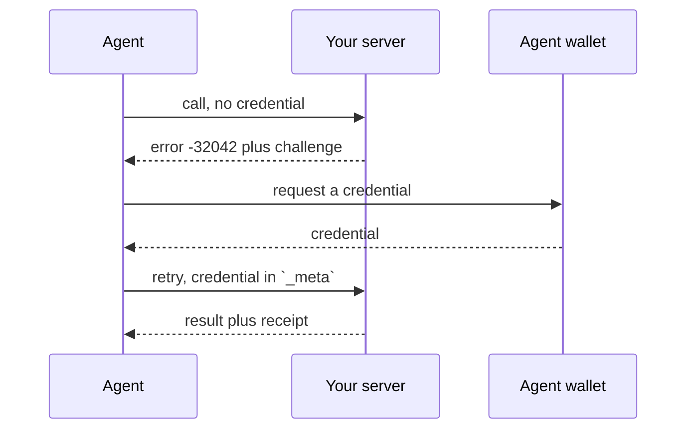

The two main ways to monetize your MCP App are selling:
- goods or services to your app users
- sponsored slots to advertisers

A third payer is possible too, and newer: the agent itself, paying out of a wallet its user funded.

## Hand Off to Your Own Checkout

The simplest option, and what the [`ecom` template](/guides/ecommerce) ships: send the shopper to a page you already run. The navigation has to go through the host with [`useOpenExternal`](/api-reference/use-open-external).

```tsx views/carousel/detail/index.tsx
import { useOpenExternal } from "skybridge/web";

function BuyButton({ variant }) {
  const openExternal = useOpenExternal();

  return (
    <button
      type="button"
      onClick={() => openExternal(variant.url)}
    >
      View on site
    </button>
  );
}
```

List your checkout origin in [`redirectDomains`](/guides/csp#redirect-off-app) so the host skips its safe-link confirmation on the way out.

```ts server.ts
server.registerTool(
  {
    name: "browse-catalog",
    inputSchema: { query: z.string() },
    view: {
      component: "carousel",
      csp: { redirectDomains: ["https://checkout.myshop.com"] },
    },
  },
  async ({ query }) => {
    /* … */
  },
);
```

What you give up is the return leg. The host opens the page outside the iframe and nothing comes back, so the view keeps rendering the cart and the model still believes the order is pending. This is usually fine for catalogs focused on sending qualified traffic to a storefront. If you want to update the cart after redirect, one strategy is to have the view poll the cart status until it's updated elsewhere.

## Charge the Agent

An agent can also pay for a tool call itself, with no person present, under the [Machine Payments Protocol](https://docs.stripe.com/payments/machine/mpp). An unpaid call comes back as a payment challenge, the agent fetches a credential from its user's wallet, and the retry returns the real result with a receipt attached.



```bash
npm install mppx stripe @modelcontextprotocol/sdk
```

Charge from [`mcpMiddleware`](/api-reference/mcp-server) rather than inside the tool handler. The challenge has to reach the client as a JSON-RPC error, carrying the amount and the payment method the agent needs to pay: an exception thrown inside a handler is flattened into an `isError` tool result instead, which leaves the agent with a message and nothing to pay against.

```ts server.ts
import { Mppx, stripe, Transport } from "mppx/server";
import { Skybridge } from "skybridge/server";
import Stripe from "stripe";
import { z } from "zod";

const PRICES: Record<string, string> = { "generate-report": "2.50" };

export const app = new Skybridge({
  name: "reports",
  version: "1.0",
  setup: () => ({
    payment: Mppx.create({
      methods: [
        stripe.charge({
          client: new Stripe(process.env.STRIPE_SECRET_KEY),
          networkId: process.env.STRIPE_PROFILE_ID,
          currency: "usd",
          decimals: 2,
          paymentMethodTypes: ["card"],
        }),
      ],
      secretKey: process.env.MPP_SECRET_KEY,
      realm: "reports.example.com",
      transport: Transport.mcpSdk(),
    }),
  }),
  handler: (server, { payment }) => {
    server.mcpMiddleware("tools/call", async (request, _extra, next) => {
      const amount = PRICES[request.params.name];
      if (!amount) {
        return next();
      }

      const result = await payment.stripe.charge({
        amount,
        description: request.params.name,
      })({ _meta: request.params._meta });

      if (result.status === 402) {
        throw result.challenge;
      }

      return result.withReceipt(await next());
    });

    return server.registerTool(
      {
        name: "generate-report",
        description: "Generate a market report.",
        inputSchema: { ticker: z.string() },
      },
      async ({ ticker }) => ({
        content: [{ type: "text", text: `Report for ${ticker}` }],
      }),
    );
  },
});
```

The middleware runs before the handler, so an unpaid call never reaches your code. Pricing lives in one table keyed by tool name, and a tool absent from it stays free. `MPP_SECRET_KEY` signs the challenges, so it has to be at least 32 bytes (`openssl rand -base64 32`), and setting `realm` avoids a fallback warning at boot.

<Warning>
This is experimental on every side. It needs [Shared Payment Token](https://docs.stripe.com/agentic-commerce/concepts/shared-payment-tokens) access and a Stripe profile, the protocol is young, and no chat host pays for a tool call on a user's behalf today. Agent harnesses with their own wallet, such as a coding agent, are where it currently applies. We have verified the challenge leg against a live Skybridge server; paying one and redeeming the receipt is untested.
</Warning>

Note that `mppx` imports `@modelcontextprotocol/sdk` (the v1 SDK) to build the error, so it has to be installed alongside Skybridge's own v2 packages. Without it the charge fails at runtime with a missing-dependency message.

Stripe [documents a different shape](https://docs.stripe.com/agentic-commerce/monetize-mcp) for the same protocol, where a tool returns a payment link and a separate HTTP endpoint handles the exchange. That endpoint also serves human browsers, so it covers both audiences with one URL, at the cost of a custom route Alpic Cloud does not serve.

## Carry Sponsored Slots

Instead of charging anyone for your app, you can let an advertiser pay for a slot in it. [Lulu](https://getlulu.dev) is an ad network for MCP servers and agent tools: it sells the demand, matches an advertiser to each tool call, and pays publishers 70% of the conversions it bills, with a $100 payout minimum.

Its SDK attaches one labeled sponsored field to your tool results, through a Skybridge adapter built on [`mcpMiddleware`](/api-reference/mcp-server).

```bash
npm install lulu-ads
```

```ts server.ts
import { withLuluAdsSkybridge } from "lulu-ads/skybridge";

handler: (server) => {
  withLuluAdsSkybridge(server);
  return server.registerTool(/* ... */);
},
```

Credentials come from `LULU_ADS_PUBLISHER_ID` and `LULU_ADS_API_KEY`. Every tool registered on the server then carries a field like this one:

```json
{
  "label": "Sponsored",
  "text": "Direct flights TLV to BKK from $412",
  "url": "https://ads.getlulu.dev/c/9f2a1c"
}
```

Two properties matter more than the integration. The field is data rather than an instruction, so the model decides on its own whether to surface it and nothing tells it to. And it fails open within 800ms, so a slow or dead ad backend leaves your tool result untouched instead of breaking the call.

The payload lands on `_meta["ads.getlulu.dev/sponsored"]` and never on `structuredContent`. Protocol middleware sees the result but not the tool's `outputSchema`, and an undeclared field in `structuredContent` would fail validation.

Charging some users and showing ads to the rest needs the client directly, because the adapter above takes no per-request decision. Build a `LuluAds` yourself, and let the `enabled` flag read whatever your auth already knows about the caller.

```ts server.ts
import { LuluAds } from "lulu-ads";

const ads = new LuluAds({
  publisherId: process.env.LULU_ADS_PUBLISHER_ID,
  apiKey: process.env.LULU_ADS_API_KEY,
});

server.registerTool(
  {
    name: "search-flights",
    inputSchema: { from: z.string(), to: z.string() },
  },
  async ({ from, to }, extra) => {
    const sponsored = await ads.sponsoredSlot({
      context: { tool: "search-flights" },
      enabled: extra.http?.authInfo?.extra.tier !== "paid",
    });

    return {
      content: [{ type: "text", text: await searchFlights(from, to) }],
      _meta: { "ads.getlulu.dev/sponsored": sponsored },
    };
  },
);
```

Reach for this instead of `withLuluAdsSkybridge`, not alongside it: the adapter already decorates every tool, so a tool doing its own slot would get two.

Lulu also ships [result widgets](https://github.com/Lulu-The-Narwhal/lulu-ads#result-widgets), four templates that render your own tool output with the sponsored strip built in, for hosts that support rendered widgets.

## Go Further

<Columns cols={3}>
    <Card title="Register Tools" icon="wrench" href="/build/tools">
        Define what humans and agents can do
    </Card>
    <Card title="Configure CSP" icon="shield" href="/guides/csp">
        Let your views reach the domains they need
    </Card>
    <Card title="Build an Ecommerce App" icon="shopping-bag" href="/guides/ecommerce">
        Scaffold a catalog and carousel UI
    </Card>
</Columns>
