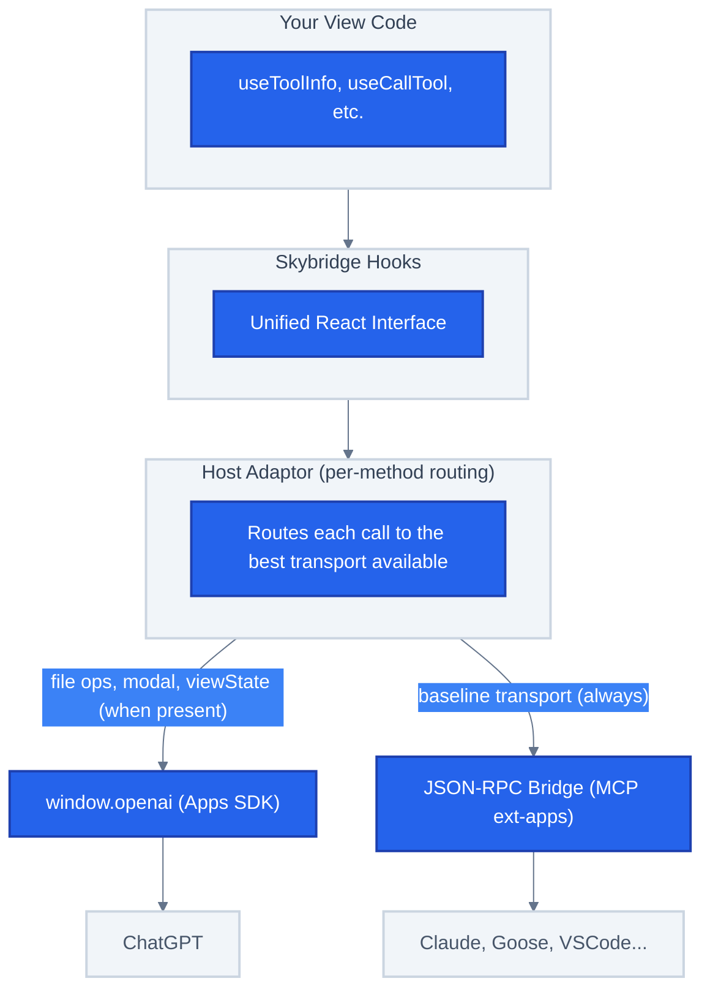

# Bridge refacto implementation plan

> **For agentic workers:** REQUIRED SUB-SKILL: Use superpowers:subagent-driven-development (recommended) or superpowers:executing-plans to implement this plan task-by-task. Steps use checkbox (`- [ ]`) syntax for tracking.

**Goal:** Collapse `AppsSdkAdaptor` and `McpAppAdaptor` into a single `HostAdaptor` class with per-method routing; treat MCP App as the always-present baseline and call `window.openai` only for methods where Apps SDK behavior is materially better or unique. Detect available runtimes by probing `window.openai` instead of reading `window.skybridge.hostType`.

**Architecture:** One `HostAdaptor` class implements the existing `Adaptor` interface. It holds `app: App` (always) and `oai: typeof window.openai | null` (present iff `window.openai` is defined). Each method encodes its routing rule inline. `getAdaptor()` becomes a memoized factory that returns a single `HostAdaptor` instance.

**Tech Stack:** TypeScript (strict, ESM), Vitest, React (`useSyncExternalStore`), `@modelcontextprotocol/ext-apps`, Zustand (consumer only), Biome (lint+format).

**Spec:** `docs/superpowers/specs/2026-05-27-bridge-refacto-design.md`

**Validation commands** (run from repo root):
- `pnpm --filter skybridge test:unit`: unit tests only (fast)
- `pnpm --filter skybridge test:format`: Biome lint+format
- `pnpm --filter skybridge build`: TypeScript compile
- `pnpm test`: full validation (unit + lint)
- `pnpm format`: auto-fix lint

---

## Task 1: Add `NotSupportedError` class and extend `Adaptor` interface

**Files:**
- Modify: `packages/core/src/web/bridges/types.ts`

Introduce a typed error for Apps-SDK-exclusive methods that the host doesn't support, and add `closeModal()` to the `Adaptor` interface so the new adaptor can host the polyfill cleanly.

- [ ] **Step 1: Write the failing test**

Create `packages/core/src/web/bridges/types.test.ts`:

```ts
import { describe, expect, it } from "vitest";
import { NotSupportedError } from "./types.js";

describe("NotSupportedError", () => {
  it("includes method name in message", () => {
    const err = new NotSupportedError("uploadFile");
    expect(err.message).toBe("uploadFile is not supported in this runtime");
    expect(err.name).toBe("NotSupportedError");
    expect(err.method).toBe("uploadFile");
  });

  it("includes reason when provided", () => {
    const err = new NotSupportedError("callTool", "MCP transport unavailable");
    expect(err.message).toBe(
      "callTool is not supported in this runtime: MCP transport unavailable",
    );
    expect(err.reason).toBe("MCP transport unavailable");
  });

  it("is an instance of Error", () => {
    expect(new NotSupportedError("x")).toBeInstanceOf(Error);
  });
});
```

- [ ] **Step 2: Run test to verify it fails**

Run: `pnpm --filter skybridge test:unit -- types.test`
Expected: FAIL with `NotSupportedError` is not exported / undefined.

- [ ] **Step 3: Add `NotSupportedError` to `types.ts`**

Append to `packages/core/src/web/bridges/types.ts`:

```ts
/**
 * Thrown when a host bridge method is called in a runtime that doesn't
 * support it (e.g. `uploadFile` outside the Apps SDK runtime).
 */
export class NotSupportedError extends Error {
  constructor(
    public readonly method: string,
    public readonly reason?: string,
  ) {
    super(
      `${method} is not supported in this runtime${reason ? `: ${reason}` : ""}`,
    );
    this.name = "NotSupportedError";
  }
}
```

- [ ] **Step 4: Add `closeModal` to the `Adaptor` interface**

In the same file, inside the `Adaptor` interface (after `setOpenInAppUrl`), add:

```ts
  /**
   * Close a modal that was opened via {@link Adaptor.openModal}. In the
   * Apps SDK runtime this is a no-op (the host owns modal lifecycle). In
   * the MCP App runtime it dismisses the in-iframe polyfill.
   */
  closeModal(): void;
```

- [ ] **Step 5: Run test to verify it passes**

Run: `pnpm --filter skybridge test:unit -- types.test`
Expected: PASS.

- [ ] **Step 6: Add `closeModal` stub to existing `AppsSdkAdaptor`**

`packages/core/src/web/bridges/apps-sdk/adaptor.ts`, append a no-op method so the interface compiles:

```ts
  public closeModal(): void {
    // Apps SDK manages modal lifecycle host-side.
  }
```

(`McpAppAdaptor` already has `closeModal` from today's modal polyfill; verify it's `public` and returns `void`. It is, no change needed.)

- [ ] **Step 7: Build + commit**

```bash
pnpm --filter skybridge build
git add packages/core/src/web/bridges/types.ts packages/core/src/web/bridges/types.test.ts packages/core/src/web/bridges/apps-sdk/adaptor.ts
git commit -m "feat(core): add NotSupportedError and closeModal to Adaptor interface"
```

---

## Task 2: Relax hostType checks in `McpAppBridge` and `AppsSdkBridge`

**Files:**
- Modify: `packages/core/src/web/bridges/mcp-app/bridge.ts:64-66`
- Modify: `packages/core/src/web/bridges/apps-sdk/bridge.ts:13-20`

The new `HostAdaptor` needs to instantiate `McpAppBridge` regardless of `hostType` (MCP transport is the universal baseline). Today both bridges throw on hostType mismatch.

- [ ] **Step 1: Write the failing test**

Create `packages/core/src/web/bridges/mcp-app/bridge.test.ts`:

```ts
import { afterEach, beforeEach, describe, expect, it, vi } from "vitest";
import { McpAppBridge } from "./bridge.js";

describe("McpAppBridge.getInstance", () => {
  beforeEach(() => {
    McpAppBridge.resetInstance();
    vi.stubGlobal("parent", { postMessage: vi.fn() });
  });
  afterEach(() => {
    vi.unstubAllGlobals();
    McpAppBridge.resetInstance();
  });

  it("instantiates when hostType is apps-sdk", () => {
    vi.stubGlobal("skybridge", { hostType: "apps-sdk" });
    expect(() => McpAppBridge.getInstance()).not.toThrow();
  });

  it("instantiates when hostType is mcp-app", () => {
    vi.stubGlobal("skybridge", { hostType: "mcp-app" });
    expect(() => McpAppBridge.getInstance()).not.toThrow();
  });
});
```

- [ ] **Step 2: Run test to verify it fails**

Run: `pnpm --filter skybridge test:unit -- bridges/mcp-app/bridge.test`
Expected: FAIL on the `apps-sdk` case with "MCP App Bridge can only be used in the mcp-app runtime".

- [ ] **Step 3: Remove hostType check in `McpAppBridge.getInstance`**

In `packages/core/src/web/bridges/mcp-app/bridge.ts`, delete lines that check `window.skybridge.hostType !== "mcp-app"` (currently lines 64-66):

```ts
  public static getInstance(
    options?: Partial<{ appInfo: Implementation }>,
  ): McpAppBridge {
    if (McpAppBridge.instance && options) {
      console.warn(
        "McpAppBridge.getInstance: options ignored, instance already exists",
      );
    }
    if (!McpAppBridge.instance) {
      const defaultOptions = {
        appInfo: { name: "skybridge-app", version: "0.0.1" },
      };
      McpAppBridge.instance = new McpAppBridge({
        ...defaultOptions,
        ...options,
      });
    }
    return McpAppBridge.instance;
  }
```

- [ ] **Step 4: Relax check in `AppsSdkBridge.getInstance`**

In `packages/core/src/web/bridges/apps-sdk/bridge.ts`, replace the throw at lines 13-20 with only the `window.openai === undefined` check:

```ts
  public static getInstance(): AppsSdkBridge {
    if (window.openai === undefined) {
      throw new Error(
        "Apps SDK Bridge requires window.openai (Apps SDK runtime).",
      );
    }
    if (AppsSdkBridge.instance === null) {
      AppsSdkBridge.instance = new AppsSdkBridge();
    }
    return AppsSdkBridge.instance;
  }
```

- [ ] **Step 5: Run tests**

```bash
pnpm --filter skybridge test:unit
```

Expected: the new bridge test passes; existing tests still pass.

- [ ] **Step 6: Commit**

```bash
git add packages/core/src/web/bridges/mcp-app/bridge.ts packages/core/src/web/bridges/apps-sdk/bridge.ts packages/core/src/web/bridges/mcp-app/bridge.test.ts
git commit -m "refactor(core): allow McpAppBridge and AppsSdkBridge to coexist regardless of hostType"
```

---

## Task 3: Extract host-context store helpers to `host-context-stores.ts`

**Files:**
- Create: `packages/core/src/web/bridges/host-context-stores.ts`
- Modify: `packages/core/src/web/bridges/mcp-app/adaptor.ts` (use the extracted helper)

Pure-function refactor with no behavior change. Frees up the next task to build `HostAdaptor` without inlining 80 lines of store-creation logic.

- [ ] **Step 1: Create `host-context-stores.ts`**

Create `packages/core/src/web/bridges/host-context-stores.ts`:

```ts
import { dequal } from "dequal/lite";
import type {
  HostContext,
  HostContextStore,
} from "./types.js";
import type { McpAppBridge } from "./mcp-app/bridge.js";
import type {
  McpAppContext,
  McpAppContextKey,
} from "./mcp-app/types.js";

type PickContext<K extends readonly McpAppContextKey[]> = {
  [P in K[number]]: McpAppContext[P];
};

/**
 * Build a memoized {@link HostContextStore} backed by one or more
 * `McpAppBridge` context keys. Recomputed values are deep-compared via
 * `dequal` so unchanged snapshots return the cached reference.
 */
function createMcpStore<const Keys extends readonly McpAppContextKey[], R>(
  bridge: McpAppBridge,
  keys: Keys,
  computeSnapshot: (context: PickContext<Keys>) => R,
) {
  let cachedValue: R | undefined;
  return {
    subscribe: bridge.subscribe(keys),
    getSnapshot: () => {
      const context = Object.fromEntries(
        keys.map((k) => [k, bridge.getSnapshot(k)]),
      ) as PickContext<Keys>;
      const newValue = computeSnapshot(context);
      if (cachedValue !== undefined && dequal(cachedValue, newValue)) {
        return cachedValue;
      }
      cachedValue = newValue;
      return newValue;
    },
  };
}

/**
 * Build the host-context store map sourced from the MCP App bridge.
 * `display` and `viewState` are *not* included here; those are handled
 * by the adaptor itself because they have transport-specific overlays
 * and additional state (polyfill modal state, localStorage hydration).
 */
export function buildMcpContextStores(bridge: McpAppBridge): {
  theme: HostContextStore<"theme">;
  locale: HostContextStore<"locale">;
  safeArea: HostContextStore<"safeArea">;
  displayMode: HostContextStore<"displayMode">;
  maxHeight: HostContextStore<"maxHeight">;
  userAgent: HostContextStore<"userAgent">;
  toolInput: HostContextStore<"toolInput">;
  toolOutput: HostContextStore<"toolOutput">;
  toolResponseMetadata: HostContextStore<"toolResponseMetadata">;
} {
  return {
    theme: createMcpStore(bridge, ["theme"], ({ theme }) => theme ?? "light"),
    locale: createMcpStore(
      bridge,
      ["locale"],
      ({ locale }) => locale ?? "en-US",
    ),
    safeArea: createMcpStore(bridge, ["safeAreaInsets"], ({ safeAreaInsets }) => ({
      insets: safeAreaInsets ?? { top: 0, right: 0, bottom: 0, left: 0 },
    })),
    displayMode: createMcpStore(
      bridge,
      ["displayMode"],
      ({ displayMode }) => displayMode ?? "inline",
    ),
    maxHeight: createMcpStore(
      bridge,
      ["containerDimensions"],
      ({ containerDimensions }) => {
        if (containerDimensions && "maxHeight" in containerDimensions) {
          return containerDimensions.maxHeight;
        }
        return undefined;
      },
    ),
    userAgent: createMcpStore(
      bridge,
      ["platform", "deviceCapabilities"],
      ({ platform, deviceCapabilities }) => ({
        device: {
          type: platform === "web" ? "desktop" : (platform ?? "unknown"),
        },
        capabilities: {
          hover: true,
          touch: true,
          ...deviceCapabilities,
        },
      }),
    ),
    toolInput: createMcpStore(
      bridge,
      ["toolInput"],
      ({ toolInput }) => toolInput ?? null,
    ),
    toolOutput: createMcpStore(
      bridge,
      ["toolResult"],
      ({ toolResult }) => toolResult?.structuredContent ?? null,
    ),
    toolResponseMetadata: createMcpStore(
      bridge,
      ["toolResult"],
      ({ toolResult }) => toolResult?._meta ?? null,
    ),
  };
}

/**
 * Build the Apps-SDK-sourced overlay stores (`display`, `viewState`).
 * Used by `HostAdaptor` only when `window.openai` is present.
 */
export function buildAppsSdkOverlayStores(bridge: import("./apps-sdk/bridge.js").AppsSdkBridge): {
  display: HostContextStore<"display">;
  viewState: HostContextStore<"viewState">;
} {
  return {
    display: {
      subscribe: bridge.subscribe("view"),
      getSnapshot: () => bridge.getSnapshot("view"),
    },
    viewState: {
      subscribe: bridge.subscribe("widgetState"),
      getSnapshot: () =>
        bridge.getSnapshot("widgetState")?.modelContent ?? null,
    },
  };
}
```

- [ ] **Step 2: Verify the existing adaptor still typechecks**

Don't refactor `McpAppAdaptor` yet; just confirm the new helpers compile.

Run: `pnpm --filter skybridge build`
Expected: success.

- [ ] **Step 3: Run all unit tests**

```bash
pnpm --filter skybridge test:unit
```

Expected: all existing tests still pass.

- [ ] **Step 4: Commit**

```bash
git add packages/core/src/web/bridges/host-context-stores.ts
git commit -m "refactor(core): extract host-context store helpers"
```

---

## Task 4: Create `HostAdaptor` skeleton with constructor and probe

**Files:**
- Create: `packages/core/src/web/bridges/adaptor.ts`

Just the class shell + constructor logic. Methods stubbed for now. Old `McpAppAdaptor` / `AppsSdkAdaptor` are still in use via `get-adaptor.ts`; nothing wires up to `HostAdaptor` yet.

- [ ] **Step 1: Write the failing test**

Create `packages/core/src/web/bridges/adaptor.test.ts`:

```ts
import { afterEach, beforeEach, describe, expect, it, vi } from "vitest";
import { HostAdaptor } from "./adaptor.js";
import { AppsSdkBridge } from "./apps-sdk/bridge.js";
import { McpAppBridge } from "./mcp-app/bridge.js";

describe("HostAdaptor constructor", () => {
  beforeEach(() => {
    McpAppBridge.resetInstance();
    AppsSdkBridge.resetInstance();
    vi.stubGlobal("skybridge", { hostType: "mcp-app" });
    vi.stubGlobal("parent", { postMessage: vi.fn() });
  });
  afterEach(() => {
    vi.unstubAllGlobals();
    McpAppBridge.resetInstance();
    AppsSdkBridge.resetInstance();
  });

  it("instantiates without window.openai (oai is null)", () => {
    vi.stubGlobal("openai", undefined);
    const adaptor = new HostAdaptor();
    expect(adaptor.hasAppsSdkOverlay()).toBe(false);
  });

  it("captures window.openai when present (oai is set)", () => {
    vi.stubGlobal("openai", { widgetState: null });
    const adaptor = new HostAdaptor();
    expect(adaptor.hasAppsSdkOverlay()).toBe(true);
  });
});
```

- [ ] **Step 2: Run test to verify it fails**

Run: `pnpm --filter skybridge test:unit -- bridges/adaptor.test`
Expected: FAIL with module-not-found.

- [ ] **Step 3: Create `adaptor.ts` skeleton**

Create `packages/core/src/web/bridges/adaptor.ts`:

```ts
import type {
  Adaptor,
  CallToolResponse,
  DownloadParams,
  DownloadResult,
  FileMetadata,
  HostContext,
  HostContextStore,
  OpenExternalOptions,
  RequestDisplayMode,
  RequestModalOptions,
  RequestSizeOptions,
  SendFollowUpMessageOptions,
  SetViewStateAction,
  UploadFileOptions,
} from "./types.js";
import { NotSupportedError } from "./types.js";
import { AppsSdkBridge } from "./apps-sdk/bridge.js";
import { McpAppBridge } from "./mcp-app/bridge.js";
import {
  buildAppsSdkOverlayStores,
  buildMcpContextStores,
} from "./host-context-stores.js";

const STORAGE_PREFIX = "sb:";
const MAX_STORAGE_ENTRIES = 200;

function findStorageKey(viewUUID: string): string | undefined {
  const suffix = `:${viewUUID}`;
  for (let i = 0; i < localStorage.length; i++) {
    const key = localStorage.key(i);
    if (key?.startsWith(STORAGE_PREFIX) && key.endsWith(suffix)) {
      return key;
    }
  }
  return undefined;
}

/**
 * @internal
 * Single composite implementation of {@link Adaptor}. Composes the MCP App
 * bridge (always present) with an optional `window.openai` overlay. Per-method
 * routing rules are encoded inline.
 */
export class HostAdaptor implements Adaptor {
  private readonly mcp: McpAppBridge;
  private readonly oai: typeof window.openai | null;
  private readonly oaiBridge: AppsSdkBridge | null;

  private readonly mcpStores: ReturnType<typeof buildMcpContextStores>;
  private readonly oaiStores: ReturnType<typeof buildAppsSdkOverlayStores> | null;

  private _viewState: HostContext["viewState"] = null;
  private readonly viewStateListeners = new Set<() => void>();
  private _viewUUID: string | null = null;

  private _polyfillDisplay: HostContext["display"] = { mode: "inline" };
  private readonly polyfillDisplayListeners = new Set<() => void>();

  constructor() {
    this.mcp = McpAppBridge.getInstance();
    this.mcpStores = buildMcpContextStores(this.mcp);

    if (typeof window !== "undefined" && window.openai !== undefined) {
      this.oai = window.openai;
      this.oaiBridge = AppsSdkBridge.getInstance();
      this.oaiStores = buildAppsSdkOverlayStores(this.oaiBridge);
    } else {
      this.oai = null;
      this.oaiBridge = null;
      this.oaiStores = null;
    }

    this.subscribeToViewUUID();
  }

  public hasAppsSdkOverlay(): boolean {
    return this.oai !== null;
  }

  // ---- Adaptor interface (stubs) ----

  public getHostContextStore<K extends keyof HostContext>(
    _key: K,
  ): HostContextStore<K> {
    throw new NotSupportedError("getHostContextStore", "not yet implemented");
  }
  public callTool(): Promise<CallToolResponse> {
    throw new NotSupportedError("callTool", "not yet implemented");
  }
  public requestDisplayMode(): Promise<{ mode: RequestDisplayMode }> {
    throw new NotSupportedError("requestDisplayMode", "not yet implemented");
  }
  public requestClose(): Promise<void> {
    throw new NotSupportedError("requestClose", "not yet implemented");
  }
  public requestSize(_size: RequestSizeOptions): Promise<void> {
    throw new NotSupportedError("requestSize", "not yet implemented");
  }
  public sendFollowUpMessage(
    _prompt: string,
    _options?: SendFollowUpMessageOptions,
  ): Promise<void> {
    throw new NotSupportedError("sendFollowUpMessage", "not yet implemented");
  }
  public openExternal(_href: string, _options?: OpenExternalOptions): void {
    throw new NotSupportedError("openExternal", "not yet implemented");
  }
  public download(_params: DownloadParams): Promise<DownloadResult> {
    throw new NotSupportedError("download", "not yet implemented");
  }
  public setViewState(_s: SetViewStateAction): Promise<void> {
    throw new NotSupportedError("setViewState", "not yet implemented");
  }
  public uploadFile(_f: File, _o?: UploadFileOptions): Promise<FileMetadata> {
    throw new NotSupportedError("uploadFile", "not yet implemented");
  }
  public getFileDownloadUrl(_f: FileMetadata): Promise<{ downloadUrl: string }> {
    throw new NotSupportedError("getFileDownloadUrl", "not yet implemented");
  }
  public selectFiles(): Promise<FileMetadata[]> {
    throw new NotSupportedError("selectFiles", "not yet implemented");
  }
  public openModal(_options: RequestModalOptions): void {
    throw new NotSupportedError("openModal", "not yet implemented");
  }
  public setOpenInAppUrl(_href: string): Promise<void> {
    throw new NotSupportedError("setOpenInAppUrl", "not yet implemented");
  }
  public closeModal(): void {
    throw new NotSupportedError("closeModal", "not yet implemented");
  }

  // ---- viewState persistence helpers (used in Task 9) ----

  private subscribeToViewUUID(): void {
    this.mcp.subscribe("toolResult")(() => {
      const toolResult = this.mcp.getSnapshot("toolResult");
      const viewUUID = (
        toolResult?._meta as Record<string, unknown> | undefined
      )?.viewUUID as string | undefined;
      if (viewUUID && viewUUID !== this._viewUUID) {
        this._viewUUID = viewUUID;
        this.restoreFromLocalStorage(viewUUID);
      }
    });
  }

  private restoreFromLocalStorage(viewUUID: string): void {
    try {
      const existingKey = findStorageKey(viewUUID);
      if (existingKey) {
        const stored = localStorage.getItem(existingKey);
        if (stored !== null) {
          this._viewState = JSON.parse(stored);
          this.viewStateListeners.forEach((l) => l());
        }
      }
    } catch (err) {
      console.error(err);
    }
  }

  protected persistToLocalStorage(
    state: Record<string, unknown> | null,
  ): void {
    if (!this._viewUUID || state === null) return;
    try {
      const oldKey = findStorageKey(this._viewUUID);
      if (oldKey) localStorage.removeItem(oldKey);
      const newKey = `${STORAGE_PREFIX}${Date.now()}:${this._viewUUID}`;
      localStorage.setItem(newKey, JSON.stringify(state));
      const keys: string[] = [];
      for (let i = 0; i < localStorage.length; i++) {
        const key = localStorage.key(i);
        if (key?.startsWith(STORAGE_PREFIX)) keys.push(key);
      }
      if (keys.length <= MAX_STORAGE_ENTRIES) return;
      keys.sort();
      const toRemove = keys.slice(0, keys.length - MAX_STORAGE_ENTRIES);
      for (const key of toRemove) localStorage.removeItem(key);
    } catch (err) {
      console.error(err);
    }
  }
}
```

- [ ] **Step 4: Run the new test**

Run: `pnpm --filter skybridge test:unit -- bridges/adaptor.test`
Expected: PASS (constructor probe works).

- [ ] **Step 5: Run all tests + build**

```bash
pnpm --filter skybridge test:unit
pnpm --filter skybridge build
```

Expected: all green.

- [ ] **Step 6: Commit**

```bash
git add packages/core/src/web/bridges/adaptor.ts packages/core/src/web/bridges/adaptor.test.ts
git commit -m "feat(core): scaffold HostAdaptor with constructor probe"
```

---

## Task 5: Implement MCP-only routed methods on `HostAdaptor`

**Files:**
- Modify: `packages/core/src/web/bridges/adaptor.ts`
- Modify: `packages/core/src/web/bridges/adaptor.test.ts`

Methods that always route to MCP regardless of overlay: `callTool`, `requestDisplayMode`, `requestClose`, `requestSize`, `download`.

- [ ] **Step 1: Write failing tests**

Append to `bridges/adaptor.test.ts`:

```ts
describe("HostAdaptor MCP-routed methods", () => {
  beforeEach(() => {
    McpAppBridge.resetInstance();
    AppsSdkBridge.resetInstance();
    vi.stubGlobal("skybridge", { hostType: "mcp-app" });
    vi.stubGlobal("parent", { postMessage: vi.fn() });
    vi.stubGlobal("openai", undefined);
  });
  afterEach(() => {
    vi.unstubAllGlobals();
    McpAppBridge.resetInstance();
    AppsSdkBridge.resetInstance();
  });

  it("callTool delegates to mcp.callServerTool", async () => {
    const adaptor = new HostAdaptor();
    const fakeApp = {
      callServerTool: vi.fn().mockResolvedValue({
        content: [],
        structuredContent: { ok: true },
        isError: false,
        _meta: { x: 1 },
      }),
    };
    // biome-ignore lint/suspicious/noExplicitAny: test seam
    (adaptor as any).mcp.getApp = vi.fn().mockResolvedValue(fakeApp);

    const result = await adaptor.callTool("greet", { name: "alice" });
    expect(fakeApp.callServerTool).toHaveBeenCalledWith({
      name: "greet",
      arguments: { name: "alice" },
    });
    expect(result.structuredContent).toEqual({ ok: true });
    expect(result.meta).toEqual({ x: 1 });
  });

  it("requestDisplayMode delegates to mcp.requestDisplayMode", async () => {
    const adaptor = new HostAdaptor();
    const fakeApp = {
      requestDisplayMode: vi.fn().mockResolvedValue({ mode: "fullscreen" }),
    };
    // biome-ignore lint/suspicious/noExplicitAny: test seam
    (adaptor as any).mcp.getApp = vi.fn().mockResolvedValue(fakeApp);
    const r = await adaptor.requestDisplayMode("fullscreen");
    expect(r.mode).toBe("fullscreen");
    expect(fakeApp.requestDisplayMode).toHaveBeenCalledWith({
      mode: "fullscreen",
    });
  });

  it("requestClose delegates to mcp.requestTeardown", async () => {
    const adaptor = new HostAdaptor();
    const fakeApp = { requestTeardown: vi.fn().mockResolvedValue(undefined) };
    // biome-ignore lint/suspicious/noExplicitAny: test seam
    (adaptor as any).mcp.getApp = vi.fn().mockResolvedValue(fakeApp);
    await adaptor.requestClose();
    expect(fakeApp.requestTeardown).toHaveBeenCalled();
  });

  it("requestSize delegates to mcp.sendSizeChanged", async () => {
    const adaptor = new HostAdaptor();
    const fakeApp = { sendSizeChanged: vi.fn().mockResolvedValue(undefined) };
    // biome-ignore lint/suspicious/noExplicitAny: test seam
    (adaptor as any).mcp.getApp = vi.fn().mockResolvedValue(fakeApp);
    await adaptor.requestSize({ width: 100, height: 200 });
    expect(fakeApp.sendSizeChanged).toHaveBeenCalledWith({
      width: 100,
      height: 200,
    });
  });

  it("download returns isError when host lacks downloadFile capability", async () => {
    const adaptor = new HostAdaptor();
    const fakeApp = {
      getHostCapabilities: () => ({}),
      downloadFile: vi.fn(),
    };
    // biome-ignore lint/suspicious/noExplicitAny: test seam
    (adaptor as any).mcp.getApp = vi.fn().mockResolvedValue(fakeApp);
    const r = await adaptor.download({ contents: [] });
    expect(r.isError).toBe(true);
    expect(fakeApp.downloadFile).not.toHaveBeenCalled();
  });
});
```

- [ ] **Step 2: Run tests to verify they fail**

Run: `pnpm --filter skybridge test:unit -- bridges/adaptor.test`
Expected: all 5 new cases FAIL (methods throw NotSupportedError).

- [ ] **Step 3: Implement the methods**

In `bridges/adaptor.ts`, replace the stubs for `callTool`, `requestDisplayMode`, `requestClose`, `requestSize`, `download`:

```ts
  public callTool = async <
    ToolArgs extends Record<string, unknown> | null = null,
    ToolResponse extends CallToolResponse = CallToolResponse,
  >(
    name: string,
    args: ToolArgs,
  ): Promise<ToolResponse> => {
    const app = await this.mcp.getApp();
    const response = await app.callServerTool({
      name,
      arguments: args ?? undefined,
    });
    return {
      content: response.content,
      structuredContent: response.structuredContent ?? {},
      isError: response.isError ?? false,
      meta: response._meta ?? {},
    } as ToolResponse;
  };

  public requestDisplayMode = async (mode: RequestDisplayMode) => {
    const app = await this.mcp.getApp();
    return app.requestDisplayMode({ mode });
  };

  public requestClose = async (): Promise<void> => {
    const app = await this.mcp.getApp();
    await app.requestTeardown();
  };

  public requestSize = async (size: RequestSizeOptions): Promise<void> => {
    const app = await this.mcp.getApp();
    await app.sendSizeChanged(size);
  };

  public download = async (
    params: DownloadParams,
  ): Promise<DownloadResult> => {
    const app = await this.mcp.getApp();
    if (!app.getHostCapabilities()?.downloadFile) {
      console.error(
        "[skybridge] download: host does not support ui/download-file",
      );
      return { isError: true };
    }
    return app.downloadFile(params);
  };
```

(Delete the corresponding stubs from the class body.)

- [ ] **Step 4: Run tests to verify they pass**

Run: `pnpm --filter skybridge test:unit -- bridges/adaptor.test`
Expected: PASS.

- [ ] **Step 5: Commit**

```bash
git add packages/core/src/web/bridges/adaptor.ts packages/core/src/web/bridges/adaptor.test.ts
git commit -m "feat(core): implement HostAdaptor MCP-routed methods"
```

---

## Task 6: Implement conditional-routing methods (`sendFollowUpMessage`, `openExternal`)

**Files:**
- Modify: `packages/core/src/web/bridges/adaptor.ts`
- Modify: `packages/core/src/web/bridges/adaptor.test.ts`

These methods route to OAI only when the caller passes an OAI-specific option (`scrollToBottom`, `redirectUrl: false`).

- [ ] **Step 1: Write failing tests**

Append to `bridges/adaptor.test.ts`:

```ts
describe("HostAdaptor conditional routing", () => {
  beforeEach(() => {
    McpAppBridge.resetInstance();
    AppsSdkBridge.resetInstance();
    vi.stubGlobal("skybridge", { hostType: "apps-sdk" });
    vi.stubGlobal("parent", { postMessage: vi.fn() });
  });
  afterEach(() => {
    vi.unstubAllGlobals();
    McpAppBridge.resetInstance();
    AppsSdkBridge.resetInstance();
  });

  it("sendFollowUpMessage uses oai when scrollToBottom set", async () => {
    const sendFollowUpMessage = vi.fn().mockResolvedValue(undefined);
    vi.stubGlobal("openai", { sendFollowUpMessage });
    const adaptor = new HostAdaptor();
    await adaptor.sendFollowUpMessage("hi", { scrollToBottom: false });
    expect(sendFollowUpMessage).toHaveBeenCalledWith({
      prompt: "hi",
      scrollToBottom: false,
    });
  });

  it("sendFollowUpMessage uses mcp when no options", async () => {
    vi.stubGlobal("openai", undefined);
    const adaptor = new HostAdaptor();
    const fakeApp = { sendMessage: vi.fn().mockResolvedValue(undefined) };
    // biome-ignore lint/suspicious/noExplicitAny: test seam
    (adaptor as any).mcp.getApp = vi.fn().mockResolvedValue(fakeApp);
    await adaptor.sendFollowUpMessage("hi");
    expect(fakeApp.sendMessage).toHaveBeenCalledWith({
      role: "user",
      content: [{ type: "text", text: "hi" }],
    });
  });

  it("openExternal uses oai when redirectUrl: false", async () => {
    const openExternal = vi.fn();
    vi.stubGlobal("openai", { openExternal });
    const adaptor = new HostAdaptor();
    adaptor.openExternal("https://x", { redirectUrl: false });
    expect(openExternal).toHaveBeenCalledWith({
      href: "https://x",
      redirectUrl: false,
    });
  });

  it("openExternal uses mcp.openLink for default case", async () => {
    vi.stubGlobal("openai", undefined);
    const adaptor = new HostAdaptor();
    const openLink = vi.fn();
    // biome-ignore lint/suspicious/noExplicitAny: test seam
    (adaptor as any).mcp.getApp = vi
      .fn()
      .mockResolvedValue({ openLink });
    adaptor.openExternal("https://x");
    // openExternal is sync but mcp.openLink resolves async
    await new Promise((r) => setTimeout(r, 0));
    expect(openLink).toHaveBeenCalledWith({ url: "https://x" });
  });
});
```

- [ ] **Step 2: Run tests to verify they fail**

Run: `pnpm --filter skybridge test:unit -- bridges/adaptor.test`
Expected: 4 new cases FAIL.

- [ ] **Step 3: Implement the methods**

Replace the two stubs in `bridges/adaptor.ts`:

```ts
  public sendFollowUpMessage = async (
    prompt: string,
    options?: SendFollowUpMessageOptions,
  ): Promise<void> => {
    if (this.oai && options?.scrollToBottom !== undefined) {
      await this.oai.sendFollowUpMessage({
        prompt,
        scrollToBottom: options.scrollToBottom,
      });
      return;
    }
    const app = await this.mcp.getApp();
    await app.sendMessage({
      role: "user",
      content: [{ type: "text", text: prompt }],
    });
  };

  public openExternal = (
    href: string,
    options?: OpenExternalOptions,
  ): void => {
    if (this.oai && options?.redirectUrl === false) {
      this.oai.openExternal({ href, redirectUrl: false });
      return;
    }
    this.mcp
      .getApp()
      .then((app) => app.openLink({ url: href }))
      .catch((err) => {
        console.error("Failed to open external link:", err);
      });
  };
```

- [ ] **Step 4: Run tests**

```bash
pnpm --filter skybridge test:unit -- bridges/adaptor.test
```

Expected: PASS.

- [ ] **Step 5: Commit**

```bash
git add packages/core/src/web/bridges/adaptor.ts packages/core/src/web/bridges/adaptor.test.ts
git commit -m "feat(core): implement HostAdaptor conditional routing (sendFollowUpMessage, openExternal)"
```

---

## Task 7: Implement Apps-SDK-only methods on `HostAdaptor`

**Files:**
- Modify: `packages/core/src/web/bridges/adaptor.ts`
- Modify: `packages/core/src/web/bridges/adaptor.test.ts`

`uploadFile`, `selectFiles`, `getFileDownloadUrl`, `setOpenInAppUrl`. Throw `NotSupportedError` when `oai` is null.

- [ ] **Step 1: Write failing tests**

Append to `bridges/adaptor.test.ts`:

```ts
describe("HostAdaptor Apps-SDK-only methods", () => {
  beforeEach(() => {
    McpAppBridge.resetInstance();
    AppsSdkBridge.resetInstance();
    vi.stubGlobal("skybridge", { hostType: "apps-sdk" });
    vi.stubGlobal("parent", { postMessage: vi.fn() });
  });
  afterEach(() => {
    vi.unstubAllGlobals();
    McpAppBridge.resetInstance();
    AppsSdkBridge.resetInstance();
  });

  it("uploadFile throws NotSupportedError when oai is null", async () => {
    vi.stubGlobal("openai", undefined);
    const adaptor = new HostAdaptor();
    await expect(adaptor.uploadFile(new File([], "x"))).rejects.toThrow(
      NotSupportedError,
    );
  });

  it("uploadFile delegates to oai.uploadFile and tracks fileId", async () => {
    const setWidgetState = vi.fn().mockResolvedValue(undefined);
    const uploadFile = vi
      .fn()
      .mockResolvedValue({ fileId: "abc", fileName: "x" });
    vi.stubGlobal("openai", {
      uploadFile,
      setWidgetState,
      widgetState: null,
    });
    const adaptor = new HostAdaptor();
    const file = new File([], "x");
    const r = await adaptor.uploadFile(file, { library: true });
    expect(uploadFile).toHaveBeenCalledWith(file, { library: true });
    expect(r.fileId).toBe("abc");
    expect(setWidgetState).toHaveBeenCalledWith(
      expect.objectContaining({ imageIds: ["abc"] }),
    );
  });

  it("selectFiles throws when oai is null", async () => {
    vi.stubGlobal("openai", undefined);
    const adaptor = new HostAdaptor();
    await expect(adaptor.selectFiles()).rejects.toThrow(NotSupportedError);
  });

  it("selectFiles throws when host version lacks support", async () => {
    vi.stubGlobal("openai", { selectFiles: undefined });
    const adaptor = new HostAdaptor();
    await expect(adaptor.selectFiles()).rejects.toThrow(/selectFiles/);
  });

  it("getFileDownloadUrl throws when oai is null", async () => {
    vi.stubGlobal("openai", undefined);
    const adaptor = new HostAdaptor();
    await expect(
      adaptor.getFileDownloadUrl({ fileId: "x" }),
    ).rejects.toThrow(NotSupportedError);
  });

  it("setOpenInAppUrl throws when oai is null", async () => {
    vi.stubGlobal("openai", undefined);
    const adaptor = new HostAdaptor();
    await expect(adaptor.setOpenInAppUrl("https://x")).rejects.toThrow(
      NotSupportedError,
    );
  });
});
```

Also add the import: `import { NotSupportedError } from "./types.js";` at the top of the test file.

- [ ] **Step 2: Run tests to verify they fail**

Run: `pnpm --filter skybridge test:unit -- bridges/adaptor.test`
Expected: 6 cases FAIL.

- [ ] **Step 3: Implement the methods**

Replace the four stubs in `bridges/adaptor.ts`:

```ts
  public uploadFile = async (
    file: File,
    options?: UploadFileOptions,
  ): Promise<FileMetadata> => {
    if (!this.oai) throw new NotSupportedError("uploadFile");
    const metadata = await this.oai.uploadFile(file, options);
    await this.trackFileIds(metadata.fileId);
    return metadata;
  };

  public selectFiles = async (): Promise<FileMetadata[]> => {
    if (!this.oai) throw new NotSupportedError("selectFiles");
    if (!this.oai.selectFiles) {
      throw new Error(
        "selectFiles is not supported by the current host version.",
      );
    }
    const files = await this.oai.selectFiles();
    if (files.length > 0) {
      await this.trackFileIds(...files.map((f) => f.fileId));
    }
    return files;
  };

  public getFileDownloadUrl = (
    file: FileMetadata,
  ): Promise<{ downloadUrl: string }> => {
    if (!this.oai) {
      return Promise.reject(new NotSupportedError("getFileDownloadUrl"));
    }
    return this.oai.getFileDownloadUrl(file);
  };

  public setOpenInAppUrl = (href: string): Promise<void> => {
    if (!this.oai) {
      return Promise.reject(new NotSupportedError("setOpenInAppUrl"));
    }
    href = href.trim();
    if (!href) throw new Error("The href parameter is required.");
    return this.oai.setOpenInAppUrl({ href });
  };

  private async trackFileIds(...fileIds: string[]): Promise<void> {
    if (!this.oai) return;
    const current = this.oai.widgetState;
    const state = current
      ? { ...current }
      : { modelContent: {}, privateContent: {} };
    if (!state.imageIds) state.imageIds = [];
    state.imageIds.push(...fileIds);
    await this.oai.setWidgetState(state);
  }
```

- [ ] **Step 4: Run tests**

```bash
pnpm --filter skybridge test:unit -- bridges/adaptor.test
```

Expected: PASS.

- [ ] **Step 5: Commit**

```bash
git add packages/core/src/web/bridges/adaptor.ts packages/core/src/web/bridges/adaptor.test.ts
git commit -m "feat(core): implement HostAdaptor Apps-SDK-only methods"
```

---

## Task 8: Implement `setViewState` with persistence routing

**Files:**
- Modify: `packages/core/src/web/bridges/adaptor.ts`
- Modify: `packages/core/src/web/bridges/adaptor.test.ts`

Apps SDK wins when present (server persistence + private content slot); otherwise localStorage LRU + `updateModelContext`. Helpers (`findStorageKey`, `persistToLocalStorage`, `restoreFromLocalStorage`) already moved into `HostAdaptor` in Task 4.

- [ ] **Step 1: Write failing tests**

Append to `bridges/adaptor.test.ts`:

```ts
describe("HostAdaptor setViewState", () => {
  beforeEach(() => {
    McpAppBridge.resetInstance();
    AppsSdkBridge.resetInstance();
    vi.stubGlobal("skybridge", { hostType: "apps-sdk" });
    vi.stubGlobal("parent", { postMessage: vi.fn() });
    localStorage.clear();
  });
  afterEach(() => {
    vi.unstubAllGlobals();
    McpAppBridge.resetInstance();
    AppsSdkBridge.resetInstance();
    localStorage.clear();
  });

  it("uses window.openai.setWidgetState when oai is present", async () => {
    const setWidgetState = vi.fn().mockResolvedValue(undefined);
    vi.stubGlobal("openai", { setWidgetState, widgetState: null });
    const adaptor = new HostAdaptor();
    await adaptor.setViewState({ count: 1 });
    expect(setWidgetState).toHaveBeenCalledWith(
      expect.objectContaining({ modelContent: { count: 1 } }),
    );
  });

  it("calls mcp.updateModelContext and writes localStorage when oai is null", async () => {
    vi.stubGlobal("openai", undefined);
    const adaptor = new HostAdaptor();
    const updateModelContext = vi.fn().mockResolvedValue(undefined);
    // biome-ignore lint/suspicious/noExplicitAny: test seam
    (adaptor as any).mcp.getApp = vi
      .fn()
      .mockResolvedValue({ updateModelContext });
    // biome-ignore lint/suspicious/noExplicitAny: test seam
    (adaptor as any)._viewUUID = "view-1";
    await adaptor.setViewState({ count: 2 });
    expect(updateModelContext).toHaveBeenCalledWith({
      structuredContent: { count: 2 },
      content: [{ type: "text", text: JSON.stringify({ count: 2 }) }],
    });
    const keys = Array.from(
      { length: localStorage.length },
      (_, i) => localStorage.key(i)!,
    );
    expect(keys.some((k) => k.endsWith(":view-1"))).toBe(true);
  });

  it("accepts an updater function form", async () => {
    vi.stubGlobal("openai", undefined);
    const adaptor = new HostAdaptor();
    // biome-ignore lint/suspicious/noExplicitAny: test seam
    (adaptor as any).mcp.getApp = vi.fn().mockResolvedValue({
      updateModelContext: vi.fn().mockResolvedValue(undefined),
    });
    // biome-ignore lint/suspicious/noExplicitAny: test seam
    (adaptor as any)._viewState = { count: 1 };
    await adaptor.setViewState((prev) => ({
      // biome-ignore lint/suspicious/noExplicitAny: test
      count: (prev as any).count + 1,
    }));
    // biome-ignore lint/suspicious/noExplicitAny: test seam
    expect((adaptor as any)._viewState).toEqual({ count: 2 });
  });
});
```

- [ ] **Step 2: Run tests to verify they fail**

Run: `pnpm --filter skybridge test:unit -- bridges/adaptor.test`
Expected: 3 cases FAIL.

- [ ] **Step 3: Implement `setViewState`**

Replace the stub in `bridges/adaptor.ts`:

```ts
  public setViewState = async (
    stateOrUpdater: SetViewStateAction,
  ): Promise<void> => {
    if (this.oai) {
      const modelContent =
        typeof stateOrUpdater === "function"
          ? stateOrUpdater(this.oai.widgetState?.modelContent ?? null)
          : stateOrUpdater;
      await this.oai.setWidgetState({
        privateContent: {},
        ...this.oai.widgetState,
        modelContent,
      });
      return;
    }

    const newState =
      typeof stateOrUpdater === "function"
        ? stateOrUpdater(this._viewState)
        : stateOrUpdater;

    // update local state immediately so successive calls see fresh state
    this._viewState = newState;
    this.viewStateListeners.forEach((l) => l());

    this.persistToLocalStorage(newState);

    try {
      const app = await this.mcp.getApp();
      await app.updateModelContext({
        structuredContent: newState,
        content: [{ type: "text", text: JSON.stringify(newState) }],
      });
    } catch (error) {
      console.error("Failed to update view state in MCP App.", error);
    }
  };
```

- [ ] **Step 4: Run tests**

```bash
pnpm --filter skybridge test:unit -- bridges/adaptor.test
```

Expected: PASS.

- [ ] **Step 5: Commit**

```bash
git add packages/core/src/web/bridges/adaptor.ts packages/core/src/web/bridges/adaptor.test.ts
git commit -m "feat(core): implement HostAdaptor setViewState with persistence routing"
```

---

## Task 9: Implement `openModal` / `closeModal` with polyfill fallback

**Files:**
- Modify: `packages/core/src/web/bridges/adaptor.ts`
- Modify: `packages/core/src/web/bridges/adaptor.test.ts`

When `oai` is present, `openModal` delegates to `window.openai.requestModal` and `closeModal` is a no-op (host owns lifecycle). When `oai` is null, both manage the polyfill `_polyfillDisplay` state.

- [ ] **Step 1: Write failing tests**

Append to `bridges/adaptor.test.ts`:

```ts
describe("HostAdaptor modal", () => {
  beforeEach(() => {
    McpAppBridge.resetInstance();
    AppsSdkBridge.resetInstance();
    vi.stubGlobal("skybridge", { hostType: "apps-sdk" });
    vi.stubGlobal("parent", { postMessage: vi.fn() });
  });
  afterEach(() => {
    vi.unstubAllGlobals();
    McpAppBridge.resetInstance();
    AppsSdkBridge.resetInstance();
  });

  it("openModal delegates to oai.requestModal when present", () => {
    const requestModal = vi.fn();
    vi.stubGlobal("openai", { requestModal });
    const adaptor = new HostAdaptor();
    adaptor.openModal({ title: "Hi" });
    expect(requestModal).toHaveBeenCalledWith({ title: "Hi" });
  });

  it("closeModal is a no-op when oai is present", () => {
    vi.stubGlobal("openai", { requestModal: vi.fn() });
    const adaptor = new HostAdaptor();
    expect(() => adaptor.closeModal()).not.toThrow();
  });

  it("openModal sets polyfill display state when oai is null", () => {
    vi.stubGlobal("openai", undefined);
    const adaptor = new HostAdaptor();
    const listener = vi.fn();
    // biome-ignore lint/suspicious/noExplicitAny: test seam
    (adaptor as any).polyfillDisplayListeners.add(listener);
    adaptor.openModal({ params: { x: 1 } });
    // biome-ignore lint/suspicious/noExplicitAny: test seam
    expect((adaptor as any)._polyfillDisplay).toEqual({
      mode: "modal",
      params: { x: 1 },
    });
    expect(listener).toHaveBeenCalled();
  });

  it("closeModal resets polyfill display state when oai is null", () => {
    vi.stubGlobal("openai", undefined);
    const adaptor = new HostAdaptor();
    adaptor.openModal({});
    adaptor.closeModal();
    // biome-ignore lint/suspicious/noExplicitAny: test seam
    expect((adaptor as any)._polyfillDisplay).toEqual({ mode: "inline" });
  });
});
```

- [ ] **Step 2: Run tests to verify they fail**

Run: `pnpm --filter skybridge test:unit -- bridges/adaptor.test`
Expected: 4 cases FAIL.

- [ ] **Step 3: Implement the methods**

Replace the two stubs in `bridges/adaptor.ts`:

```ts
  public openModal = (options: RequestModalOptions): void => {
    if (this.oai) {
      this.oai.requestModal(options);
      return;
    }
    this._polyfillDisplay = { mode: "modal", params: options.params };
    this.polyfillDisplayListeners.forEach((l) => l());
  };

  public closeModal = (): void => {
    if (this.oai) return; // host owns modal lifecycle
    this._polyfillDisplay = { mode: "inline" };
    this.polyfillDisplayListeners.forEach((l) => l());
  };
```

- [ ] **Step 4: Run tests**

```bash
pnpm --filter skybridge test:unit -- bridges/adaptor.test
```

Expected: PASS.

- [ ] **Step 5: Commit**

```bash
git add packages/core/src/web/bridges/adaptor.ts packages/core/src/web/bridges/adaptor.test.ts
git commit -m "feat(core): implement HostAdaptor modal routing with polyfill fallback"
```

---

## Task 10: Implement `getHostContextStore` with overlay routing

**Files:**
- Modify: `packages/core/src/web/bridges/adaptor.ts`
- Modify: `packages/core/src/web/bridges/adaptor.test.ts`

When `oai` is present: `display` and `viewState` keys route to the OAI overlay stores. All other keys route to the MCP-sourced stores. When `oai` is null: `display` routes to the polyfill state, `viewState` routes to the local LRU-hydrated state, all others go to MCP.

- [ ] **Step 1: Write failing tests**

Append to `bridges/adaptor.test.ts`:

```ts
describe("HostAdaptor getHostContextStore", () => {
  beforeEach(() => {
    McpAppBridge.resetInstance();
    AppsSdkBridge.resetInstance();
    vi.stubGlobal("skybridge", { hostType: "apps-sdk" });
    vi.stubGlobal("parent", { postMessage: vi.fn() });
  });
  afterEach(() => {
    vi.unstubAllGlobals();
    McpAppBridge.resetInstance();
    AppsSdkBridge.resetInstance();
  });

  it("routes `display` to oai when overlay is present", () => {
    vi.stubGlobal("openai", { view: { mode: "fullscreen" } });
    const adaptor = new HostAdaptor();
    const store = adaptor.getHostContextStore("display");
    expect(store.getSnapshot()).toEqual({ mode: "fullscreen" });
  });

  it("routes `viewState` to oai.widgetState.modelContent when overlay present", () => {
    vi.stubGlobal("openai", {
      widgetState: { modelContent: { count: 5 }, privateContent: {} },
    });
    const adaptor = new HostAdaptor();
    const store = adaptor.getHostContextStore("viewState");
    expect(store.getSnapshot()).toEqual({ count: 5 });
  });

  it("routes `display` to polyfill when oai is null", () => {
    vi.stubGlobal("openai", undefined);
    const adaptor = new HostAdaptor();
    const store = adaptor.getHostContextStore("display");
    expect(store.getSnapshot()).toEqual({ mode: "inline" });
    adaptor.openModal({});
    expect(store.getSnapshot()).toEqual({ mode: "modal", params: undefined });
  });

  it("routes `viewState` to local LRU state when oai is null", () => {
    vi.stubGlobal("openai", undefined);
    const adaptor = new HostAdaptor();
    const store = adaptor.getHostContextStore("viewState");
    expect(store.getSnapshot()).toBe(null);
  });

  it("routes other keys (theme, locale, etc.) to mcp regardless of overlay", () => {
    vi.stubGlobal("openai", { view: { mode: "inline" } });
    const adaptor = new HostAdaptor();
    const theme = adaptor.getHostContextStore("theme");
    // default fallback when no notification yet
    expect(theme.getSnapshot()).toBe("light");
  });
});
```

- [ ] **Step 2: Run tests to verify they fail**

Run: `pnpm --filter skybridge test:unit -- bridges/adaptor.test`
Expected: 5 cases FAIL.

- [ ] **Step 3: Implement `getHostContextStore`**

Replace the stub in `bridges/adaptor.ts`:

```ts
  public getHostContextStore = <K extends keyof HostContext>(
    key: K,
  ): HostContextStore<K> => {
    if (this.oaiStores && (key === "display" || key === "viewState")) {
      return this.oaiStores[key] as HostContextStore<K>;
    }

    if (key === "display") {
      return {
        subscribe: (onChange: () => void) => {
          this.polyfillDisplayListeners.add(onChange);
          return () => {
            this.polyfillDisplayListeners.delete(onChange);
          };
        },
        getSnapshot: () => this._polyfillDisplay,
      } as HostContextStore<K>;
    }

    if (key === "viewState") {
      return {
        subscribe: (onChange: () => void) => {
          this.viewStateListeners.add(onChange);
          return () => {
            this.viewStateListeners.delete(onChange);
          };
        },
        getSnapshot: () => this._viewState,
      } as HostContextStore<K>;
    }

    return this.mcpStores[key as keyof typeof this.mcpStores] as HostContextStore<K>;
  };
```

- [ ] **Step 4: Run tests**

```bash
pnpm --filter skybridge test:unit -- bridges/adaptor.test
```

Expected: PASS.

- [ ] **Step 5: Run all tests + build**

```bash
pnpm --filter skybridge test:unit
pnpm --filter skybridge build
```

Expected: green. Old adaptors are still in use via `get-adaptor.ts` so existing tests continue to pass.

- [ ] **Step 6: Commit**

```bash
git add packages/core/src/web/bridges/adaptor.ts packages/core/src/web/bridges/adaptor.test.ts
git commit -m "feat(core): implement HostAdaptor getHostContextStore with overlay routing"
```

---

## Task 11: Rewrite `get-adaptor.ts` to return `HostAdaptor`

**Files:**
- Modify: `packages/core/src/web/bridges/get-adaptor.ts`
- Create: `packages/core/src/web/bridges/get-adaptor.test.ts`

Memoized factory returning a single `HostAdaptor` instance. No longer reads `window.skybridge.hostType` for adaptor selection (probe is now inside `HostAdaptor` constructor).

- [ ] **Step 1: Write the failing test**

Create `packages/core/src/web/bridges/get-adaptor.test.ts`:

```ts
import { afterEach, beforeEach, describe, expect, it, vi } from "vitest";
import { HostAdaptor } from "./adaptor.js";
import { AppsSdkBridge } from "./apps-sdk/bridge.js";
import { _resetAdaptor, getAdaptor } from "./get-adaptor.js";
import { McpAppBridge } from "./mcp-app/bridge.js";

describe("getAdaptor", () => {
  beforeEach(() => {
    _resetAdaptor();
    McpAppBridge.resetInstance();
    AppsSdkBridge.resetInstance();
    vi.stubGlobal("parent", { postMessage: vi.fn() });
  });
  afterEach(() => {
    vi.unstubAllGlobals();
    _resetAdaptor();
    McpAppBridge.resetInstance();
    AppsSdkBridge.resetInstance();
  });

  it("returns a HostAdaptor instance", () => {
    vi.stubGlobal("skybridge", { hostType: "mcp-app" });
    vi.stubGlobal("openai", undefined);
    expect(getAdaptor()).toBeInstanceOf(HostAdaptor);
  });

  it("memoizes the instance", () => {
    vi.stubGlobal("skybridge", { hostType: "mcp-app" });
    vi.stubGlobal("openai", undefined);
    const a = getAdaptor();
    const b = getAdaptor();
    expect(a).toBe(b);
  });

  it("logs a warning when hostType disagrees with probe", () => {
    const warn = vi.spyOn(console, "warn").mockImplementation(() => {});
    vi.stubGlobal("skybridge", { hostType: "mcp-app" });
    vi.stubGlobal("openai", { view: { mode: "inline" } });
    getAdaptor();
    expect(warn).toHaveBeenCalledWith(
      expect.stringContaining("hostType"),
    );
    warn.mockRestore();
  });

  it("does not warn when hostType matches probe", () => {
    const warn = vi.spyOn(console, "warn").mockImplementation(() => {});
    vi.stubGlobal("skybridge", { hostType: "apps-sdk" });
    vi.stubGlobal("openai", { view: { mode: "inline" } });
    getAdaptor();
    expect(warn).not.toHaveBeenCalled();
    warn.mockRestore();
  });
});
```

- [ ] **Step 2: Run test to verify it fails**

Run: `pnpm --filter skybridge test:unit -- bridges/get-adaptor.test`
Expected: FAIL (current factory returns old adaptor classes).

- [ ] **Step 3: Rewrite `get-adaptor.ts`**

Replace the entire contents of `packages/core/src/web/bridges/get-adaptor.ts`:

```ts
import { HostAdaptor } from "./adaptor.js";
import type { Adaptor } from "./types.js";

let cached: HostAdaptor | null = null;

/**
 * @internal
 * Resolve the single host {@link Adaptor} instance. Prefer the documented
 * hooks (`useCallTool`, `useViewState`, etc.) over calling this directly;
 * it's the escape hatch used by the hooks themselves and by advanced
 * integrations.
 */
export const getAdaptor = (): Adaptor => {
  if (cached) return cached;

  const hostType = window.skybridge?.hostType;
  const hasOai = typeof window !== "undefined" && window.openai !== undefined;

  if (hostType === "mcp-app" && hasOai) {
    console.warn(
      "[skybridge] hostType is 'mcp-app' but window.openai is present; trusting the probe.",
    );
  } else if (hostType === "apps-sdk" && !hasOai) {
    console.warn(
      "[skybridge] hostType is 'apps-sdk' but window.openai is absent; trusting the probe.",
    );
  }

  cached = new HostAdaptor();
  return cached;
};

/** @internal Test-only. */
export const _resetAdaptor = (): void => {
  cached = null;
};
```

- [ ] **Step 4: Run tests**

```bash
pnpm --filter skybridge test:unit -- bridges/get-adaptor.test
```

Expected: PASS.

- [ ] **Step 5: Run all unit tests**

```bash
pnpm --filter skybridge test:unit
```

Expected: most pass, but **some existing tests that rely on the old adaptor instances may now fail** because they exercise the singleton via `McpAppAdaptor.resetInstance()` etc. Note the failures; they will be fixed in Task 13.

- [ ] **Step 6: Commit**

```bash
git add packages/core/src/web/bridges/get-adaptor.ts packages/core/src/web/bridges/get-adaptor.test.ts
git commit -m "feat(core): rewrite getAdaptor to return memoized HostAdaptor"
```

---

## Task 12: Migrate `ModalProvider` to the new adaptor

**Files:**
- Modify: `packages/core/src/web/components/modal-provider.tsx`

`ModalProvider` currently imports `McpAppAdaptor` directly and calls its `closeModal`. With the new design, it uses `getAdaptor()` and the now-public `closeModal` method.

- [ ] **Step 1: Replace contents of `modal-provider.tsx`**

```tsx
import { type ReactNode, useEffect, useSyncExternalStore } from "react";
import { getAdaptor } from "../bridges/index.js";

const modalStyles = `
.sb-modal-backdrop {
  position: fixed;
  inset: 0;
  background: rgba(0, 0, 0, 0.5);
  z-index: 9998;
}
.sb-modal-container {
  border-radius: 12px;
  position: fixed;
  inset: 0;
  margin: auto;
  width: fit-content;
  height: fit-content;
  background: white;
  z-index: 9999;
}
`;

export function ModalProvider({ children }: { children: ReactNode }) {
  const adaptor = getAdaptor();
  const displayStore = adaptor.getHostContextStore("display");
  const { mode } = useSyncExternalStore(
    displayStore.subscribe,
    displayStore.getSnapshot,
  );
  const isOpen = mode === "modal";

  const handleBackdropClick = (e: React.MouseEvent) => {
    if (e.target === e.currentTarget) {
      adaptor.closeModal();
    }
  };

  useEffect(() => {
    if (!isOpen) return;
    const handler = (e: KeyboardEvent) => {
      if (e.key === "Escape") {
        adaptor.closeModal();
      }
    };
    document.addEventListener("keydown", handler);
    return () => document.removeEventListener("keydown", handler);
  }, [isOpen, adaptor]);

  return (
    <>
      <style>{modalStyles}</style>
      {isOpen && (
        // biome-ignore lint/a11y/useKeyWithClickEvents: backdrop isn't focusable
        <div
          role="dialog"
          className="sb-modal-backdrop"
          onClick={handleBackdropClick}
        />
      )}
      <div className={isOpen ? "sb-modal-container" : undefined}>
        {children}
      </div>
    </>
  );
}
```

Note: when Apps SDK overlay is active, the host portals its own modal outside the iframe; the `display.mode === "modal"` signal from `window.openai.view` would normally trigger this in-iframe polyfill too, causing a double overlay. Since `closeModal()` is a no-op under the overlay, and the host modal is on top of our iframe (z-index host-controlled), the visual collision is bounded. Document this as a known limitation. A follow-up task (out of scope) can add an `adaptor.hasAppsSdkOverlay()` check to skip the polyfill render entirely.

- [ ] **Step 2: Run all unit tests**

```bash
pnpm --filter skybridge test:unit
```

Expected: passes for `modal-provider`-related cases (if any exist).

- [ ] **Step 3: Commit**

```bash
git add packages/core/src/web/components/modal-provider.tsx
git commit -m "refactor(core): migrate ModalProvider to HostAdaptor via getAdaptor"
```

---

## Task 13: Update hook tests that reference old adaptor classes

**Files:**
- Modify: every `packages/core/src/web/hooks/*.test.ts` and `*.test.tsx` that imports `McpAppAdaptor`, `AppsSdkAdaptor`, `McpAppBridge`, or `AppsSdkBridge`
- Modify: `packages/core/src/web/create-store.test.ts`
- Modify: `packages/core/src/web/data-llm.test.tsx`

Tests today reset the old adaptor singletons (`McpAppAdaptor.resetInstance()`, etc.) and stub `window.skybridge.hostType` to pick the runtime. The new model needs `_resetAdaptor()` from `get-adaptor.ts` plus appropriate `window.openai` stubbing.

This task is most efficient run as **parallel subagents**: each test file is independent, so dispatch one agent per file.

- [ ] **Step 1: Run the unit suite to identify failing tests**

```bash
pnpm --filter skybridge test:unit 2>&1 | tee /tmp/sb-test-failures.txt
```

Note the list of failing files.

- [ ] **Step 2: For each failing test file, apply this migration recipe**

In `beforeEach`:

- Replace `McpAppAdaptor.resetInstance()` and `AppsSdkAdaptor.resetInstance()` with a single `_resetAdaptor()` call (imported from `../bridges/get-adaptor.js`).
- Keep `McpAppBridge.resetInstance()` / `AppsSdkBridge.resetInstance()` if the test exercises those bridges directly via `useMcpAppContext` / `useAppsSdkContext`.
- For Apps SDK tests: keep `vi.stubGlobal("skybridge", { hostType: "apps-sdk" })` AND `vi.stubGlobal("openai", {...})`. Both must be set; the new factory probes `window.openai`.
- For MCP App tests: keep `vi.stubGlobal("skybridge", { hostType: "mcp-app" })`, ensure `vi.stubGlobal("openai", undefined)`.

In imports:
- Remove `import { McpAppAdaptor } from "..."` / `AppsSdkAdaptor`. Replace direct method calls (rare) with `getAdaptor()`.

- [ ] **Step 3: Dispatch parallel subagents to update each failing file**

For each failing test file `<path>`, dispatch a subagent with this brief:

```
Update test file <path> for the bridge refacto.

Refacto context: McpAppAdaptor and AppsSdkAdaptor classes have been replaced
with a single HostAdaptor class. getAdaptor() is now memoized via a module-
level cache; reset it with _resetAdaptor() imported from
packages/core/src/web/bridges/get-adaptor.ts. The runtime is detected by
probing window.openai instead of reading window.skybridge.hostType.

Migration recipe:
1. Imports: remove McpAppAdaptor/AppsSdkAdaptor imports. Add `_resetAdaptor`
   from "../bridges/get-adaptor.js" if the file resets between tests.
2. beforeEach: replace McpAppAdaptor.resetInstance() and
   AppsSdkAdaptor.resetInstance() with _resetAdaptor(). Keep
   McpAppBridge.resetInstance()/AppsSdkBridge.resetInstance() calls.
3. Globals: ensure both window.skybridge.hostType AND window.openai are
   stubbed. For Apps SDK tests, openai must be a non-null object. For
   MCP App tests, openai must be explicitly undefined.
4. Direct adaptor-method calls (rare): rewrite via getAdaptor().method().

Run `pnpm --filter skybridge test:unit -- <basename>` to verify the file
passes after edits. Do not modify other files. Stop and surface any test
that can't be migrated within the recipe.
```

Run all such subagents in parallel.

- [ ] **Step 4: Re-run the full unit suite**

```bash
pnpm --filter skybridge test:unit
```

Expected: all green. If any failures remain, address individually.

- [ ] **Step 5: Run lint**

```bash
pnpm --filter skybridge test:format
```

Expected: green (or run `pnpm format` to auto-fix).

- [ ] **Step 6: Commit**

```bash
git add packages/core/src/web/
git commit -m "test(core): migrate hook and integration tests to HostAdaptor"
```

---

## Task 14: Delete old adaptor classes and update bridge exports

**Files:**
- Delete: `packages/core/src/web/bridges/mcp-app/adaptor.ts`
- Delete: `packages/core/src/web/bridges/apps-sdk/adaptor.ts`
- Modify: `packages/core/src/web/bridges/mcp-app/index.ts`
- Modify: `packages/core/src/web/bridges/apps-sdk/index.ts`

`McpAppAdaptor` and `AppsSdkAdaptor` have no remaining production callers (modal-provider was migrated in Task 12) and no remaining test callers (Task 13). Safe to delete.

`McpAppBridge` and `AppsSdkBridge` stay; they back `useMcpAppContext` / `useAppsSdkContext` (documented escape hatches) and are used by `HostAdaptor`.

- [ ] **Step 1: Confirm no callers remain**

```bash
grep -rE "McpAppAdaptor|AppsSdkAdaptor" packages/core/src --include='*.ts' --include='*.tsx' | grep -v 'bridges/mcp-app/adaptor.ts' | grep -v 'bridges/apps-sdk/adaptor.ts'
```

Expected: empty output. If any matches remain, fix them before proceeding.

- [ ] **Step 2: Delete the old adaptor files**

```bash
rm packages/core/src/web/bridges/mcp-app/adaptor.ts
rm packages/core/src/web/bridges/apps-sdk/adaptor.ts
```

- [ ] **Step 3: Update `bridges/mcp-app/index.ts`**

Replace `packages/core/src/web/bridges/mcp-app/index.ts`:

```ts
export { McpAppBridge } from "./bridge.js";
export type {
  McpAppContext,
  McpAppContextKey,
  McpToolState,
} from "./types.js";
export { useMcpAppContext } from "./use-mcp-app-context.js";
```

- [ ] **Step 4: Update `bridges/apps-sdk/index.ts`**

Replace `packages/core/src/web/bridges/apps-sdk/index.ts`:

```ts
export { AppsSdkBridge } from "./bridge.js";
export type {
  AppsSdkContext,
  AppsSdkMethods,
  AppsSdkWidgetState,
  ToolResponseEvent,
} from "./types.js";
export {
  SET_GLOBALS_EVENT_TYPE,
  SetGlobalsEvent,
  TOOL_RESPONSE_EVENT_TYPE,
} from "./types.js";
export { useAppsSdkContext } from "./use-apps-sdk-context.js";
```

- [ ] **Step 5: Build + run tests**

```bash
pnpm --filter skybridge build
pnpm --filter skybridge test:unit
```

Expected: both green. If the build complains about removed exports, find the importer and fix it (should not happen since Step 1 verified no callers).

- [ ] **Step 6: Commit**

```bash
git add -A packages/core/src/web/bridges/
git commit -m "refactor(core): remove obsolete McpAppAdaptor and AppsSdkAdaptor classes"
```

---

## Task 15: Update Mermaid diagram in concept docs

**Files:**
- Modify: `docs/concepts/write-once-run-everywhere.mdx`

The Mermaid diagram references "Apps SDK Adaptor" and "MCP App Adaptor" as separate subgraphs. Update it to reflect a single `HostAdaptor` with two transport sources.

- [ ] **Step 1: Replace the Mermaid block (lines 22-59) with the single-adaptor diagram**

Open `docs/concepts/write-once-run-everywhere.mdx` and replace the entire ```` ```mermaid ... ``` ```` block with:

````

````

- [ ] **Step 2: Update the prose at line 61**

Replace:

```
Skybridge automatically detects which runtime is available and uses the appropriate adaptor.
```

with:

```
Skybridge detects which transports are available at load time and routes each call to the one that handles it best: the MCP ext-apps transport is always used as the baseline, and `window.openai` takes over for capabilities where Apps SDK behavior is materially better or unique.
```

- [ ] **Step 3: Commit**

```bash
git add docs/concepts/write-once-run-everywhere.mdx
git commit -m "docs: update write-once diagram for single HostAdaptor"
```

---

## Task 16: Final validation

- [ ] **Step 1: Full test suite from repo root**

```bash
pnpm test
```

Expected: green (unit + lint).

- [ ] **Step 2: Full build from repo root**

```bash
pnpm build
```

Expected: green.

- [ ] **Step 3: Confirm public API unchanged**

```bash
# What does index.ts export?
grep -nE "^export" packages/core/src/web/index.ts
# Verify the documented hooks list is intact
grep -nE "^export" packages/core/src/web/hooks/index.ts
```

Expected: no removed exports. The `Adaptor` interface, `getAdaptor`, all hooks, `createStore`, `mountView` are present.

The only net additions:
- `NotSupportedError` class
- `closeModal()` method on the `Adaptor` interface (no-op when Apps SDK overlay is active)

The only net removals (acceptable per spec, both were `@internal`):
- `McpAppAdaptor`, `AppsSdkAdaptor` class exports

- [ ] **Step 4: Manual smoke (optional, requires devtools setup)**

If devtools is set up locally, mount one of the `examples/` apps and verify:
- View loads inside devtools (MCP-app baseline)
- `callTool` works
- `useViewState` persists across remounts (uses localStorage path)
- `useLayout` returns expected theme/locale

Skip if devtools setup is not handy; the unit tests cover the routing logic.

- [ ] **Step 5: Final commit (if any leftover changes)**

```bash
git status
# If anything is unstaged from format/build artifacts:
git add -A
git commit -m "chore: finalize bridge refacto"
```

---

## Self-review checklist (for the planner, before handoff)

- Every method in the `Adaptor` interface (14 original + new `closeModal`) has at least one routing test in `adaptor.test.ts`.
- Both `oai` present and `oai` null cases are exercised for: `setViewState`, `openModal`, `closeModal`, `sendFollowUpMessage`, `openExternal`, `getHostContextStore("display"|"viewState")`.
- `NotSupportedError` thrown for Apps-SDK-only methods when `oai` is null: `uploadFile`, `selectFiles`, `getFileDownloadUrl`, `setOpenInAppUrl`.
- localStorage LRU path remains testable (Task 8 covers the write side; the read side is exercised on tool-result notifications in the existing bridge tests).
- Public API surface: `Adaptor` interface unchanged in shape except for the additive `closeModal`. `getAdaptor` semantics unchanged from the caller's perspective (still returns an `Adaptor`). `McpAppBridge`, `AppsSdkBridge`, `useMcpAppContext`, `useAppsSdkContext`, all hooks intact.
