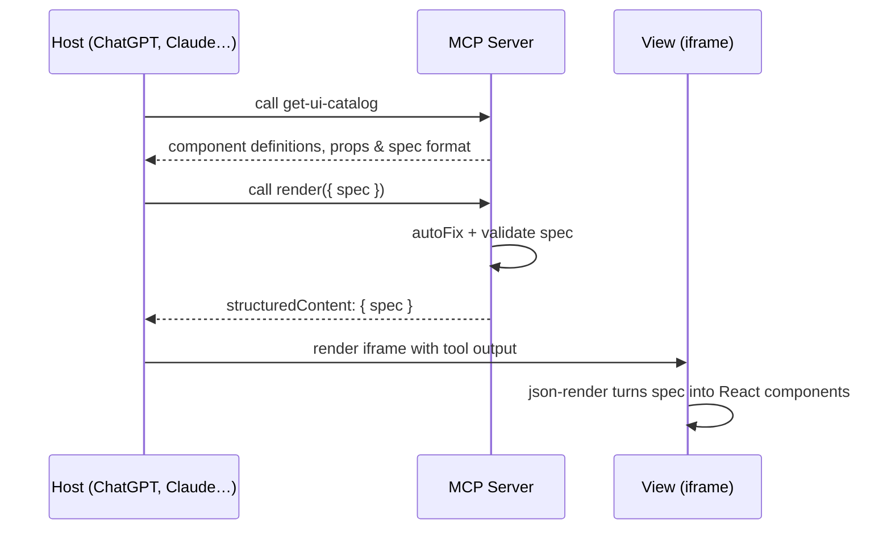

# Generative UI Example

An example MCP app built with [Skybridge](https://docs.skybridge.tech/home) and [json-render](https://github.com/vercel-labs/json-render). It displays dynamic, personalized UIs built from a predefined and reliable catalog of components, following prompt from the model.

## What This Example Showcases

This example uses the default catalog of shadcn/ui components provided by json-render.
The shadcn/ui catalog is too large to be exposed as tool description, so we expose a `get-ui-catalog` tool instead to inject the whole catalog as a tool response in the model context.

The model generates a flat JSON spec as input of the `render` tool. json-render turns this spec into real React components displayed in the view associated with this tool.
The `render` tool validates the spec against the catalog and auto-fixes common mistakes before rendering.

The full catalog is verbose — it consumes roughly as many tokens as having the LLM generate raw HTML directly. For production use, curate a smaller, domain-specific component set.



## Live Demo

[Try it in Alpic's Playground](https://generative-ui.skybridge.tech/try) to launch the live widget experience, or use the MCP URL with your client of choice: `https://generative-ui.skybridge.tech/mcp`.

## Getting Started

### Prerequisites

- Node.js 24+

### Local Development

#### 1. Install

```bash
npm install
# or
yarn install
# or
pnpm install
# or
bun install
```

#### 2. Start your local server

Run the development server from the root directory:

```bash
npm run dev
# or
yarn dev
# or
pnpm dev
# or
bun dev
```

This command starts:

- Your MCP server at `http://localhost:3000/mcp`.
- Skybridge DevTools UI at `http://localhost:3000/`.

#### 3. Project structure

```
│   └── server.ts          # Server entry point (catalog + render tool)
│   ├── src/
│   │   ├── views/
│   │   │   └── render.tsx    # Renderer widget (json-render + shadcn)
│   │   ├── helpers.ts        # Shared utilities
│   │   └── index.css         # Global styles
│   └── vite.config.ts
├── alpic.json                # Deployment config
└── package.json
```

### Create your first widget

#### 1. Add a new widget

- Register a widget in `src/server.ts` with a unique name (e.g., `my-widget`) using [`registerTool`](https://docs.skybridge.tech/api-reference/register-tool)
- Create a matching React component at `src/views/my-widget.tsx`. **The file name must match the widget name exactly**.

#### 2. Edit widgets with Hot Module Replacement (HMR)

Edit and save components in `src/views/` — changes will appear instantly inside your App.

#### 3. Edit server code

Modify files in `server/` and refresh the connection with your testing MCP Client to see the changes.

### Testing your App

You can test your App locally by using our DevTools UI on `http://localhost:3000` while running the dev command.

To test your app with other MCP Clients like ChatGPT, Claude or VSCode, see [Testing Your App](https://docs.skybridge.tech/quickstart/test-your-app).

## Deploy to Production

Skybridge is infrastructure vendor agnostic, and your app can be deployed on any cloud platform supporting MCP.

The simplest way to deploy your App in minutes is [Alpic](https://alpic.ai/).

1. Create an account on [Alpic platform](https://app.alpic.ai/).
2. Connect your GitHub repository to automatically deploy at each commit.
3. Use your remote App URL to connect it to MCP Clients, or use the Alpic Playground to easily test your App.

[](https://app.alpic.ai/new/clone?repositoryUrl=https://github.com/alpic-ai/skybridge&rootDir=examples/generative-ui)

## Resources

- [Skybridge Documentation](https://docs.skybridge.tech/)
- [json-render](https://github.com/vercel-labs/json-render)
- [Apps SDK Documentation](https://developers.openai.com/apps-sdk)
- [Model Context Protocol Documentation](https://modelcontextprotocol.io/)
- [Alpic Documentation](https://docs.alpic.ai/)
