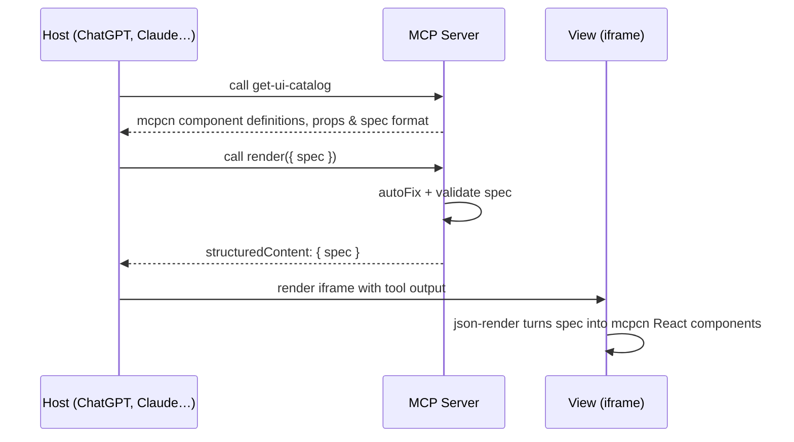

# mcpcn Starter

An example MCP app built with [Skybridge](https://docs.skybridge.tech/home): a starter template combining Skybridge with [mcpcn](https://mcpcn.dev) agentic component library for building rich, interactive widgets.

## What This Example Showcases

### Skybridge features

- **Interactive Widget Rendering**: A React-based widget that displays an interactive product carousel directly in AI conversations
- **Tool Info Access**: Widgets access tool input, output, and metadata via `useToolInfo()` hook
- **Theme Support**: Adapts to light/dark mode using the `useUser()` hook
- **Localization**: Translates UI based on user locale via `useUser()` hook
- **Persistent State**: Maintains cart state across re-renders using `useWidgetState()` hook
- **Modal Dialogs**: Opens checkout modal via `useRequestModal()` hook
- **External Links**: Opens external URL for checkout completion via `useOpenExternal()` hook
- **External API Integration**: Demonstrates fetching data from REST APIs
- **Hot Module Replacement**: Live reloading of widget components during development

### mcpcn features

- **Agentic UI components**: Choose from a wide selection of blocks and components made for agentic usage
- **Shadcn/ui and Tailwind**: Official [shadcn/ui registry](https://ui.shadcn.com) with full compatibility with the 2 most popular UI/CSS libs
- **1-Command install**: With simple CLI commands like `npx shadcn@latest add @mcpcn/hero`
- **100% Customizable**: Style once, apply everywhere

## Live Demo

[Try it in Alpic's Playground](https://mcpcn.skybridge.tech/try) to launch the live widget experience, or use the MCP URL with your client of choice: `https://mcpcn.skybridge.tech/mcp`.

## Getting Started

### Prerequisites

- Node.js 24+

### Local Development

#### 1. Install

```bash
npm install
# or
yarn install
# or
pnpm install
# or
bun install
```

#### 2. Start your local server

Run the development server from the root directory:

```bash
npm run dev
# or
yarn dev
# or
pnpm dev
# or
bun dev
```

This command starts:

- Your MCP server at `http://localhost:3000/mcp`.
- Skybridge DevTools UI at `http://localhost:3000/`.

#### 3. Project structure

```
├── src/
│   ├── server.ts           # Server entry point
│   ├── components/
│   │   └── ui/             # mcpcn components (hero, button, …)
│   ├── lib/
│   │   └── utils.ts        # Shared utilities
│   ├── views/
│   │   ├── hello-world.tsx # Example widget
│   │   └── render.tsx      # Generative UI renderer (json-render)
│   └── index.css           # Global styles
├── components.json         # shadcn/ui config
└── vite.config.ts
├── alpic.json              # Deployment config
└── package.json
```

### Create your first widget

#### 1. Add a new widget

- Register a widget in `src/server.ts` with a unique name (e.g., `my-widget`) using [`registerTool`](https://docs.skybridge.tech/api-reference/register-tool)
- Create a matching React component at `src/views/my-widget.tsx`. **The file name must match the widget name exactly**.

#### 2. Edit widgets with Hot Module Replacement (HMR)

Edit and save components in `src/views/` — changes will appear instantly inside your App.

#### 3. Install new components (mcpcn)

Choose your component from [mcpcn website](https://mcpcn.dev) and copy the CLI Command and run it in the project root:

```bash
# Install the hero component with npx
npx shadcn@latest add @mcpcn/hero
```

And use it in your widget:

```tsx
import {
  Hero,
  HeroActions,
  HeroContent,
  HeroDescription,
  HeroLogos,
  HeroTechLogos,
  HeroTitle,
} from "@/components/ui/hero";

return (
  <Hero
    data={{
      title: "Hello world!",
      subtitle: "Let's build some apps",
    }}
    actions={{
      onPrimaryClick: () => openExternal("https://mcpcn.dev"),
    }}
  >
    <HeroContent>
      <HeroLogos />
      <HeroTitle />
      <HeroDescription />
      <HeroActions />
      <HeroTechLogos />
    </HeroContent>
  </Hero>
);
```

#### 4. Generative UI with json-render

This example also includes a generative UI renderer powered by [json-render](https://github.com/vercel-labs/json-render). The model can dynamically compose UI from the mcpcn component catalog at runtime.

The server exposes two tools:
- **`get-ui-catalog`**: Returns the full mcpcn component catalog so the model knows available components, props, and the spec format
- **`render`**: Takes a json-render spec and renders it as live React components



To use it, ask the MCP client to call `get-ui-catalog` first, then `render` with a generated spec.

#### 5. Edit server code

Modify files in `server/` and refresh the connection with your testing MCP Client to see the changes.

### Testing your App

You can test your App locally by using our DevTools UI on `http://localhost:3000` while running the dev command.

To test your app with other MCP Clients like ChatGPT, Claude or VSCode, see [Testing Your App](https://docs.skybridge.tech/quickstart/test-your-app).

## Deploy to Production

Skybridge is infrastructure vendor agnostic, and your app can be deployed on any cloud platform supporting MCP.

The simplest way to deploy your App in minutes is [Alpic](https://alpic.ai/).

1. Create an account on [Alpic platform](https://app.alpic.ai/).
2. Connect your GitHub repository to automatically deploy at each commit.
3. Use your remote App URL to connect it to MCP Clients, or use the Alpic Playground to easily test your App.

## Resources

- [Skybridge Documentation](https://docs.skybridge.tech/)
- [mcpcn](https://mcpcn.dev)
- [Apps SDK Documentation](https://developers.openai.com/apps-sdk)
- [Model Context Protocol Documentation](https://modelcontextprotocol.io/)
- [Alpic Documentation](https://docs.alpic.ai/)
