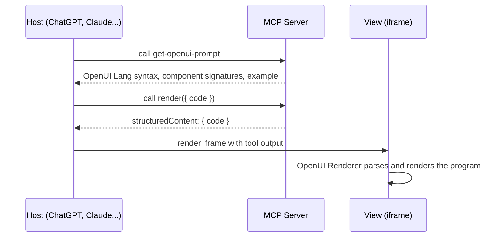

# OpenUI Generative UI Example

An example MCP app built with [Skybridge](https://docs.skybridge.tech/home) and [OpenUI](https://www.openui.com). It renders dynamic UI from OpenUI Lang generated by the model.

## What This Example Showcases

This example uses OpenUI's standard React component library instead of a JSON renderer catalog. The server exposes `get-openui-prompt`, which returns the generated OpenUI Lang instructions from `openuiLibrary.prompt()`. The model then calls `render` with an OpenUI Lang program. The Skybridge view renders that program with OpenUI's React `<Renderer />`.



OpenUI Lang is compact and stream-friendly: the first line defines `root`, while later lines can fill in forward references as the model generates details.

## Getting Started

### Prerequisites

- Node.js 24+

### Local Development

Install dependencies from the monorepo root:

```bash
pnpm install
```

Run this example:

```bash
pnpm --filter skybridge-openui-generative-ui-example dev
```

This starts:

- MCP server at `http://localhost:3000/mcp`
- Skybridge DevTools UI at `http://localhost:3000/`

### Try the Bundled Demo

Use the `render-example` tool for a quick smoke test, or ask the host to:

1. Call `get-openui-prompt`.
2. Generate OpenUI Lang for a dashboard, report, checklist, or plan.
3. Call `render` with the generated `code`.

## Project Structure

```text
src/
  openui/
    library.tsx       # OpenUI standard library, Skybridge prompt rules, example code
  views/
    render.tsx        # Skybridge iframe view using OpenUI Renderer
  server.ts           # MCP server tools
  helpers.ts          # Typed Skybridge hooks
  index.css           # OpenUI CSS imports and Skybridge theme tokens
```

## Resources

- [OpenUI Documentation](https://www.openui.com/docs/openui-lang)
- [OpenUI Renderer](https://www.openui.com/docs/openui-lang/renderer)
- [OpenUI Standard Library](https://www.openui.com/docs/openui-lang/standard-library)
- [Skybridge Documentation](https://docs.skybridge.tech/home)
- [Model Context Protocol Documentation](https://modelcontextprotocol.io)
