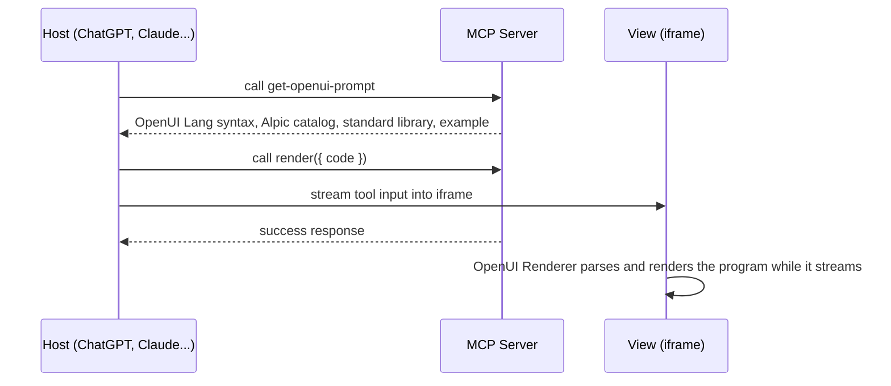

# OpenUI Generative UI Example

An example MCP app built with [Skybridge](https://docs.skybridge.tech/home) and [OpenUI](https://www.openui.com). It renders dynamic UI from OpenUI Lang generated by the model, using Alpic's custom component catalog on top of OpenUI's standard library.

## What This Example Showcases

This example shows how a Skybridge MCP app can offer Generative UI with a **custom Alpic catalog** — `PageHeader`, `StatCard`, `ProjectCard`, `StatusBadge`, `InsightCallout`, and `ActionButton` — built with [`@alpic-ai/ui`](https://www.npmjs.com/package/@alpic-ai/ui) and registered through OpenUI's `defineComponent` / `createLibrary` APIs.

The server exposes `get-openui-prompt`, which returns OpenUI Lang instructions from `openuiLibrary.prompt()`. That prompt includes both the standard OpenUI primitives (`Stack`, charts, tables, …) and the Alpic group. The model then calls `render` with an OpenUI Lang program. The Skybridge view renders that program with OpenUI's React `<Renderer />`.


```mermaid
sequenceDiagram
    participant Host as Host (ChatGPT, Claude...)
    participant Server as MCP Server
    participant View as View (iframe)

    Host->>Server: call get-openui-prompt
    Server-->>Host: OpenUI Lang syntax, Alpic catalog, standard library, example

    Host->>Server: call render({ code })
    Host->>View: stream tool input into iframe
    Server-->>Host: success response
    View->>View: OpenUI Renderer parses and renders the program while it streams
```

OpenUI Lang is compact and stream-friendly: the first line defines `root`, while later lines can fill in forward references as the model generates details.

## Getting Started

### Prerequisites

- Node.js 24+

### Local Development

Install dependencies from the monorepo root:

```bash
pnpm install
```

Run this example:

```bash
pnpm --filter skybridge-openui-generative-ui-example dev
```

This starts:

- MCP server at `http://localhost:3000/mcp`
- Skybridge DevTools UI at `http://localhost:3000/`

### Try the Demo Flow

Ask the host to:

1. Call `get-openui-prompt`.
2. Use the included Alpic workspace example, or generate OpenUI Lang for an MCP app dashboard, project list, or deploy report.
3. Call `render` with the generated `code`.

## Project Structure

```text
src/
  openui/
    alpic-catalog.tsx # Alpic custom components (PageHeader, StatCard, ProjectCard, …)
    library.tsx       # createLibrary: standard OpenUI + Alpic group, prompt, example
  views/
    render.tsx        # Skybridge iframe view using OpenUI Renderer
  server.ts           # MCP server tools
  helpers.ts          # Typed Skybridge hooks
  index.css           # Alpic theme tokens and OpenUI CSS
```

## Resources

- [OpenUI Documentation](https://www.openui.com/docs/openui-lang)
- [OpenUI Renderer](https://www.openui.com/docs/openui-lang/renderer)
- [OpenUI Standard Library](https://www.openui.com/docs/openui-lang/standard-library)
- [Defining custom OpenUI components](https://www.openui.com/docs/openui-lang/defining-components)
- [Skybridge Documentation](https://docs.skybridge.tech/home)
- [Model Context Protocol Documentation](https://modelcontextprotocol.io)
